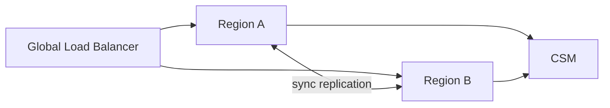

# 24/7 stack pattern

Instant rails ([[../concepts/sct-inst]], [[../concepts/sic-ip]], [[../concepts/fps]]) demand 24/7/365 ops. Different from batch banking. Design pattern below.

## Requirements

- No maintenance windows visible to clients
- Sub-10s end-to-end SLA at p99
- Sanctions / fraud / limits all hot-path
- Idempotent retries on partial failure
- Survive single-region failure

## Pattern: hot-hot active-active

- Both regions take live traffic
- Synchronous replication on critical state (payment status)
- Either region can fail without service interruption
- Connection to CSM (TIPS / RT1) duplicated, primary + standby

## State management

- **Event sourcing** preferred — append-only log, derive state via projection
- Or **single-writer per payment** with optimistic locking
- Avoid distributed transactions across services — saga + compensations

## Idempotency

- Inbound: keyed by message ID + UETR; replay returns same response
- Outbound to CSM: pacs.008 with same UETR retried, CSM dedupes
- Internal events: keyed by `paymentId + version`

## Database choices (logical, not vendor)

- Hot OLTP (Postgres / Cockroach / Spanner / Aurora) — payment state
- Append-only log (Kafka / Pulsar / Kinesis) — events
- In-memory cache (Redis / Hazelcast) — sanctions cleared sets, customer flags
- OLAP / lakehouse — recon, reporting (offline)

## Deployment

- Kubernetes / EKS / OpenShift / vSphere — same logical pattern
- Separate availability zones, regional active-active
- Blue-green for app, careful with stateful services
- Schema migrations with zero-downtime patterns (expand-contract)

## Operational maintenance

- Rolling deploy across regions
- Canary on small % traffic
- DR drill quarterly
- Chaos engineering — kill components in prod (Netflix-style)

## Linked

[[sct-inst-logical]] · [[sct-inst-physical-vendor-map]] · [[../regulations/dora]]
