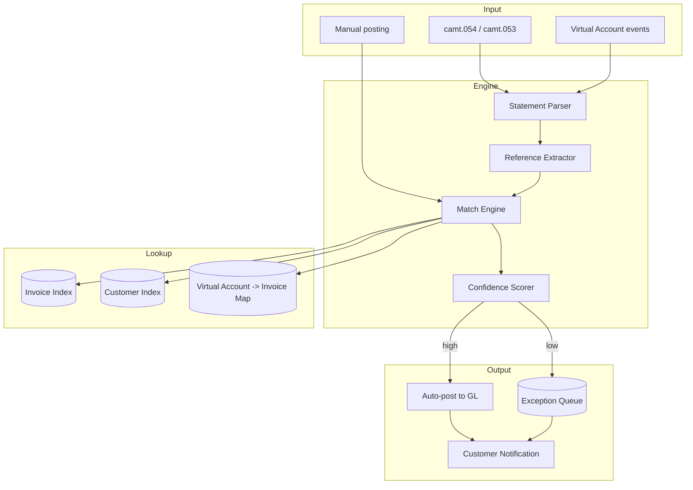

# AR reconciliation pattern

Match-engine architecture for QR-bill / SEPA / wire receivables.

## Components

## Match cascade

Implement as priority chain — first match wins:

1. Structured QR reference exact → invoice match
2. Virtual account number → mapped invoice
3. ISO 11649 RF in remittance → invoice
4. Invoice number regex match in unstructured → invoice (low confidence boost)
5. Fuzzy: payer + amount + date window → invoice (confidence scored)

## Lookups

- **Invoice index** — by structured ref (primary key) + secondary indexes on invoice number, customer ID
- **Virtual account map** — VA number → invoice ID, mutable per VA strategy
- **Customer index** — by name (normalized + n-gram) for fuzzy match

## Performance

- Streaming or batch (per camt.054 receipt)
- Per-credit match latency <200ms (single lookup) or <2s (fuzzy)
- Throughput: 10K-100K credits/day for typical mid-corp; large utilities may hit 1M+

## Storage

- OLTP for invoice + payment application records
- Append-only event log for audit
- Search index (Elasticsearch / OpenSearch / typesense) for fuzzy lookups + ops UI

## Idempotency

- Each camt entry has unique reference (acquirer ref + entry seq)
- Replay of same camt = no-op
- Manual postings keyed by user + timestamp + invoice

## Cross-cutting

- Normalize amounts (rounding, currency conversion if mismatch)
- Time zones — settlement date vs business date discrepancies
- Multi-currency — match on (invoice currency = payment currency) primary; conversion path for mismatches

## Vendor options

| Capability | Build | Buy |
|---|---|---|
| Match engine | Kotlin/Java + Postgres + ES | Kyriba Receivables · HighRadius · Esker · BlackLine |
| QR-bill parser | Custom (spec public from SIX) | bundled in many CH ERP/AR tools |
| Bank statement intake | Custom (camt.053 / camt.054) | TMS integration |

## Linked

[[../processes/ar-reconciliation]] · [[qr-bill-issuance-pattern]] · [[../decisions/0005-virtual-accounts-vs-qr-iban]]
