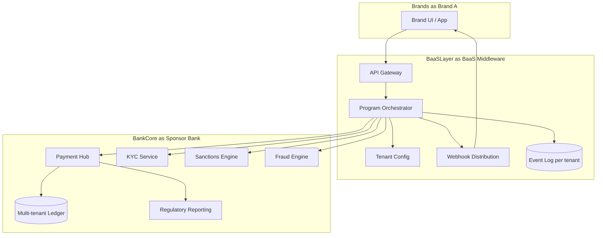

# BaaS platform architecture pattern

Sponsor bank stack for hosting multiple fintech / brand programs.

## Multi-tenancy

- Tenant = brand program
- Per-tenant: configuration (limits, products, KYC rules), branding, webhooks
- Shared: bank ledger, regulatory reporting, sanctions engine

## Customer money segregation

- Per [[../regulations/psd2-psd3]] safeguarding (PSD2 art 10)
- Customer funds in segregated trust account at sponsor bank, separated from brand operating funds
- Reconciliation: per-tenant ledger ↔ aggregate trust account
- Daily reconciliation mandatory (regulator focus post-Synapse)

## Reconciliation challenge

- Multi-tenant ledger must reconcile to aggregated bank account
- Any discrepancy = potential customer money issue
- Recent enforcement (US OCC / EU BaFin) focuses on this gap
- Strong recon discipline = differentiator

## Vendors

- BaaS middleware platforms: Unit, Bond (FIS), Solaris white-label, M2P
- Internal-build common at top-tier sponsor banks
- Combined w/ core banking: Mambu, Thought Machine, 10x ([[../vendors/mambu]] etc.)

## Related

[[../concepts/baas]] · [[../decisions/0011-baas-vs-direct]] · [[../regulations/psd2-psd3]]
