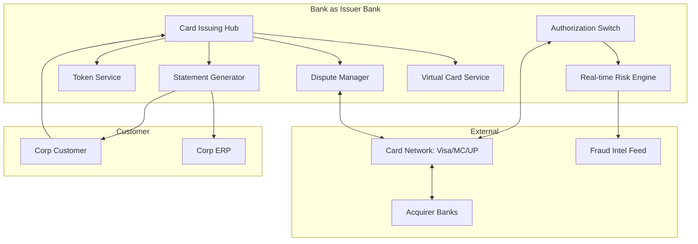

# Card issuing architecture pattern

Components for commercial card issuing program.

## Components

| Component | Responsibility |
|---|---|
| Card Issuing Hub | Card lifecycle (issuance, replacement, blocking), program mgmt |
| Authorization Switch | Real-time auth req/resp with networks (sub-200ms) |
| Risk Engine | Per-tx fraud + compliance check |
| Token Service | Tokenize PAN for digital wallets, virtual cards |
| Statement Generator | Cycle-based + on-demand statements, Level III data |
| Dispute Manager | Chargeback initiation + network case mgmt |
| Virtual Card Service | Issue per-use card numbers, control limits + validity |

## Vendors / outsource

- Full BaaS issuer: Marqeta, Adyen Issuing, Galileo, Stripe Issuing
- Traditional: FIS, TSYS (Global Payments), Worldline
- Specialty: Paymentology, Solaris (Germany)
- Build + scheme partnership: large incumbents

## Network connectivity

- VisaNet / Banknet / UnionPay direct connection
- Sub-second auth SLA
- 24/7/365
- DR mandatory (network-imposed)

## Related

[[../concepts/card-schemes]] · [[../concepts/commercial-card]] · [[../concepts/virtual-card]] · [[../processes/commercial-card-issuance]]
