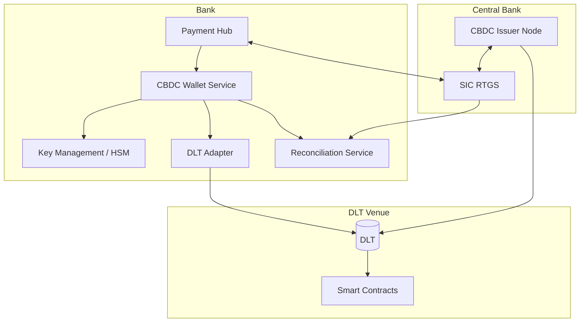
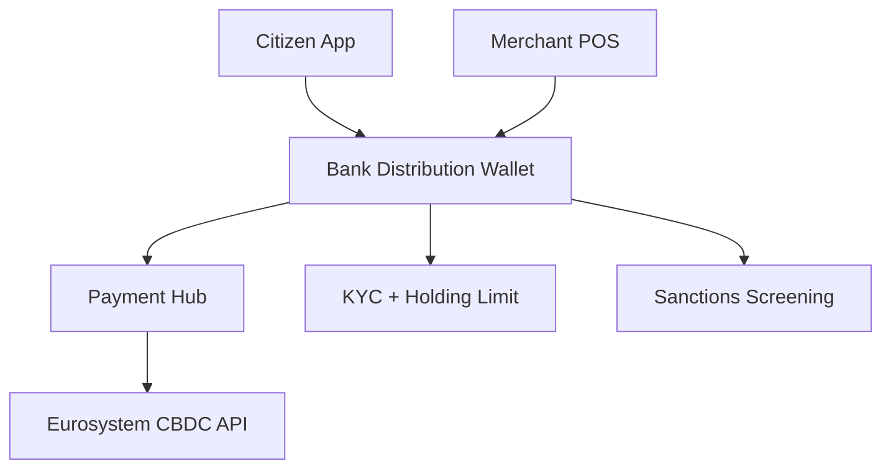

# CBDC integration pattern

Bank's architecture to integrate with wholesale + retail CBDC infrastructure.

## Wholesale CBDC integration

## Components

| Component | Responsibility |
|---|---|
| CBDC Wallet Service | Hold + manage token balances, multi-wallet per legal entity |
| Key Management / HSM | Cryptographic keys for token signing, FIPS 140-2 L3+ |
| DLT Adapter | Protocol-specific (Corda / Hyperledger / Ethereum-compatible / proprietary) |
| Reconciliation Service | Token balance ↔ central bank reserve equivalence check |

## Retail CBDC integration (post digital euro)

## Key design decisions

- Custody model — bank-managed vs self-custody
- Offline support — secure element (smartphone TEE) vs online-only
- Privacy tiers — anonymous low-value, identified high-value
- Interop with existing payment rails — wallet ↔ DDA transfer

## Vendor / tech

- DLT platforms: Corda (R3), Hyperledger Fabric / Besu, proprietary (SDX)
- HSMs: Thales, Utimaco, Entrust
- Wallet platforms: bank-built, fintech partnerships
- Standards-watch: BIS-led (PvP, DvP, cross-border interop)

## Linked

[[../concepts/wholesale-cbdc]] · [[../concepts/retail-cbdc]] · [[../concepts/digital-euro]] · [[../processes/wholesale-cbdc-settlement]]
