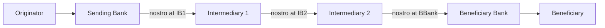
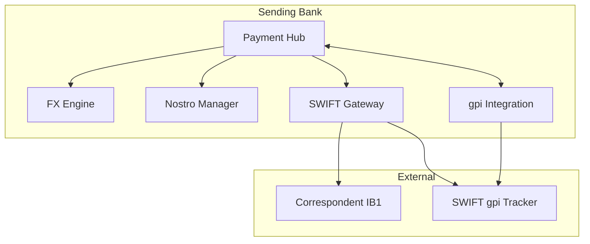

# Correspondent chain pattern

Architecture for cross-border wire processing across multiple-bank chain.

## Concept

## Key concepts

- **Nostro account** — "our account at their bank" (foreign currency)
- **Vostro account** — "their account at our bank"
- Each leg = movement in nostro/vostro pair
- USD chain: non-US banks hold nostros at major US banks
- Nostro reconciliation = continuous match against MT940/camt.053 from correspondent

## Components

## Nostro management

- Multiple correspondents per currency (redundancy)
- Real-time position monitoring against intraday MT942 / camt.052
- Auto-funding rules (if nostro low, auto-FX from other CCY)
- EOD reconciliation against correspondent statements
- Aging on unmatched items

## Routing decision

- Sending bank picks first-hop correspondent based on:
  - Currency (USD → JPM, EUR → BNP/Deutsche, etc.)
  - Beneficiary's country (regional correspondent specialization)
  - Cost (per-tx fee + FX spread)
  - SLA (gpi-enabled correspondent preferred)
  - Sanctions stance (avoid correspondents with known holds)

## SWIFT gateway

- Alliance Access (on-prem) or Lite2 (cloud)
- Connects to SWIFT network via SIPN
- Mandatory CSP controls (annual attestation)
- API integration with hub via MQ / file / REST adapter

## gpi integration

- Hub posts UETR to tracker on send
- Hub subscribes to status updates per UETR
- Status events drive [[../states/cross-border-wire-lifecycle]] transitions
- Customer-facing API exposes tracker data

## Vendor map

| Component | Build | Buy |
|---|---|---|
| SWIFT Gateway | n/a | Alliance Access / Lite2 / Bottomline / IBM Sterling |
| Translation MT↔MX | Custom challenging | Volante · Bottomline · Eastnets |
| Nostro reconciliation | Custom | SmartStream · Broadridge · Frontier · Bank-built |
| gpi integration | Custom | SWIFT gpi APIs + bank's own integration |

## Linked

[[../processes/originate-cross-border-wire]] · [[gpi-tracker-integration]] · [[sct-inst-physical-vendor-map]]
