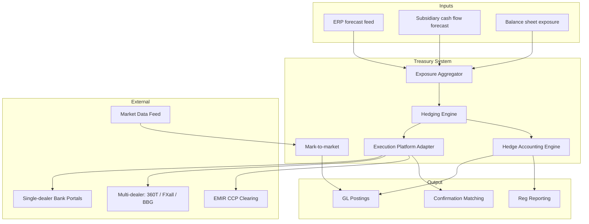

# FX treasury architecture pattern

Components for treasury FX hedging + execution + accounting.

## Components

| Component | Responsibility |
|---|---|
| Exposure Aggregator | Net exposure per CCY pair across entities |
| Hedging Engine | Apply hedge policy, generate trade list |
| Execution Platform Adapter | Submit to single / multi-dealer venues, FIX or proprietary |
| Hedge Accounting Engine | IFRS 9 designation, effectiveness, documentation |
| Mark-to-market | Daily revaluation of open positions |
| Confirmation Matching | Match trade confirmations from counterparty |

## Vendors

- **TMS w/ FX module**: Kyriba, GTreasury, FIS Quantum, ION Wallstreet
- **Specialty FX**: 360T, FXall, Bloomberg FXGO (execution)
- **Hedge accounting**: Reval (now ION), Hedgebook, Findur (ION)
- **Confirmation matching**: MarkitWire, Misys Confirmation Matching

## EMIR clearing

- Some FX derivatives mandated through CCP ([[../regulations/emir]])
- Variation margin daily on bilateral non-cleared
- Trade reporting T+1 to TR

## Linked

[[../concepts/fx-spot]] · [[../concepts/fx-forward]] · [[../concepts/fx-options]] · [[../concepts/hedge-accounting]] · [[../regulations/emir]]
