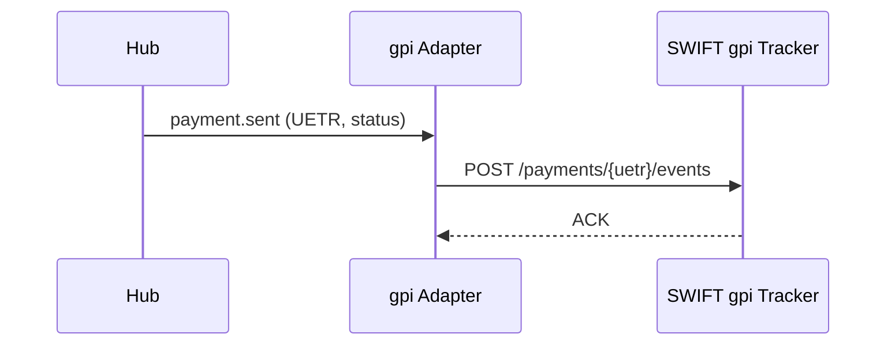
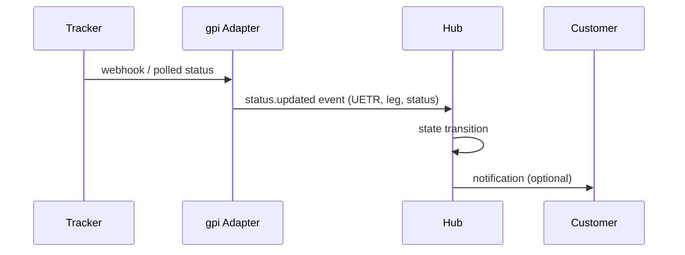

# gpi tracker integration pattern

Architecture for posting + consuming gpi tracker events.

## Outbound (sending bank)

## Inbound (any bank in chain receives status updates)

## Tech contract

- gpi tracker exposes:
  - REST APIs (modern)
  - Legacy MT199 status messages (some banks still emit)
- Idempotency: events keyed by UETR + leg + sequence
- Replay: tracker provides full history on query

## Pre-validation (gpi pre-validation)

- Pre-flight call to beneficiary bank: "is this IBAN/BIC + name pair valid?"
- Reduces repair rate by 70-90% (per SWIFT data)
- Available for participating banks only
- Sub-second latency typically

## Customer-facing exposure

- Corporate API exposes:
  - Status query by UETR
  - Webhook subscription for status changes
  - History view
- Drives ERP/TMS integration

## Linked

[[correspondent-chain-pattern]] · [[../processes/gpi-tracking]] · [[../concepts/api]]
