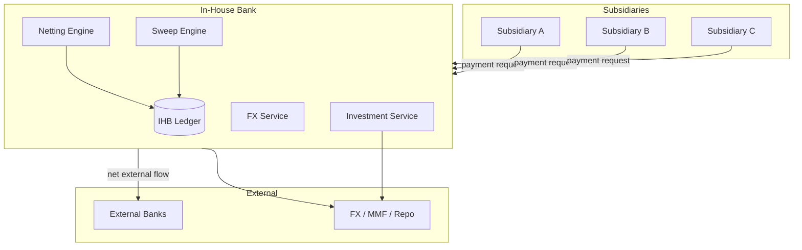

# In-house bank pattern

Centralized corporate treasury entity acting as internal bank for subsidiaries.

## Components

## Capabilities

- **Internal payments** — intercompany transactions netted at IHB ledger; no external bank cost
- **Payment factory** — IHB initiates external payments on behalf of subsidiaries (POBO — Payments On Behalf Of)
- **Receipts factory** — IHB receives on behalf (ROBO — Receipts On Behalf Of)
- **Netting** — multilateral netting reduces FX + payment costs
- **FX hedging** — central treasury runs hedging program
- **Investment** — central deployment of group cash
- **Tax + transfer pricing** — IHB charges subs at agreed rate

## Architecture

- **IHB Ledger** — double-entry, multi-currency, multi-entity
- **External bank gateway** — small set of bank relationships (vs each sub having its own)
- **TMS** integration — IHB is core treasury system
- **ERP** integration — subs post to IHB via shared service centre flows

## Variants

- **In-house bank lite** — netting + central FX, no POBO
- **Full IHB** — POBO/ROBO across multi-CCY multi-entity
- **Multi-entity IHB** — separate IHB per region (EMEA, APAC, Americas)

## Considerations

- Banking license? — typically not (no third-party banking activity)
- Regulatory: cross-border treasury rules (FX restrictions in some countries)
- Tax: thin capitalization, transfer pricing
- IT: integration with all sub ERPs

## Linked

[[../concepts/in-house-bank]] · [[../concepts/payment-factory]] · [[../processes/intraday-liquidity]] · [[../processes/sweep-orchestration]]
