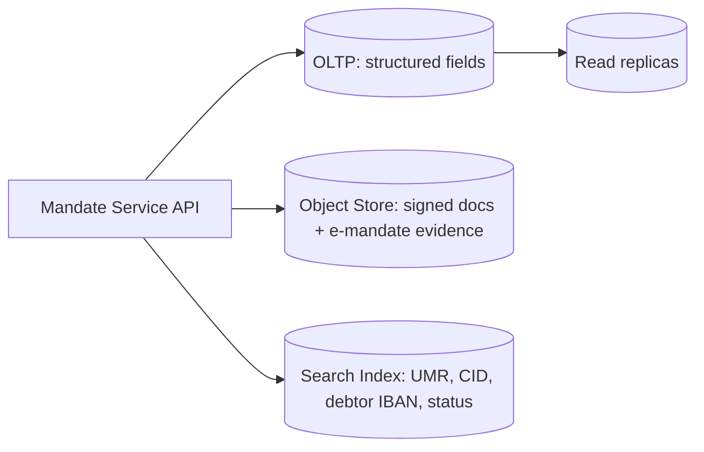

# Mandate management pattern

Storage + lifecycle + audit for SEPA Direct Debit mandates.

## Two-tier storage

- **OLTP**: Postgres / Cockroach, Mandate row with status + amendments
- **Object store**: scanned PDFs, e-mandate proof, encrypted at rest, immutable + versioned bucket
- **Search index**: lookups by debtor IBAN, CID, status, date range

## Lifecycle automation

- Daily job: scan for mandates inactive >36 months → state=Expired
- On amendment event: append to amendments array, never overwrite
- On cancellation: state=Cancelled, retain document indefinitely (audit)

## Audit trail

- Every transition emits event with diff
- Retention: lifetime of mandate + 14 months post-last-use (Core scheme rule); local AML may extend to 10y

## Document handling

- Receive signed PDF via channel
- OCR + structured extract for human review
- Validation: signature present, debtor name + IBAN match form fields, date plausible
- Store: hash for tamper detection, encrypted with KMS-managed key

## E-mandate path

- Inbound from EBS (e-banking signing) or e-Mandate scheme
- XML evidence package: signed by debtor PSP
- Store as document with metadata flag `signatureMethod: EMANDATE`

## Reuse across rails

- UK [[../concepts/bacs]] DD mandates have analogous lifecycle (DDI — Direct Debit Instruction)
- Different scheme rules (DDG indemnity in UK)
- Same logical pattern, separate stores or shared with rail discriminator field

## Linked

[[sdd-logical]] · [[../states/mandate-lifecycle]] · [[../decisions/0004-mandate-storage]] · [[../regulations/gdpr]]
