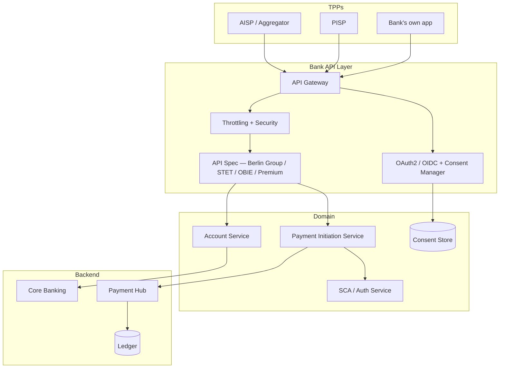

# Open Banking architecture pattern

Bank-side architecture for PSD2 + premium API exposure.

## Components

| Component | Responsibility |
|---|---|
| API Gateway | Edge (mTLS, eIDAS cert validation), routing, auth handoff |
| Consent Manager | OAuth2 consent storage, per-account grants, expiry, revoke |
| SCA Service | Strong Customer Auth flow (redirect, decoupled, embedded) |
| Account Service | Read-only domain — balance, transactions, list of accounts |
| Payment Initiation Service | PIS endpoint — submit to hub on customer auth |

## Auth flow (PIS — payment init via TPP)

1. TPP requests payment initiation via API
2. Bank API checks TPP cert (eIDAS QSeal / QWAC)
3. Bank redirects user to bank app for SCA
4. User authenticates, sees payment details (dynamic linking)
5. User approves
6. Bank executes via [[sct-inst-logical]] hub
7. Bank returns status to TPP

## DORA / NFR alignment

- Open Banking APIs subject to [[../regulations/dora]] availability + incident reporting
- IPR ([[../regulations/instant-payments-regulation]]) drives [[../concepts/sct-inst]] from PIS
- High-uptime expectations under PSD3 / PSR (kills modified customer interface fallback)

## Vendor / build options

- API platforms: Apigee, Kong, AWS API Gateway, Mulesoft
- Open banking-specific: Tink (acquired Visa), Tessera (Plaid acquisition), Ozone API, KONSENTUS
- Build in-house common at tier-1 banks

## Related

[[../concepts/aisp]] · [[../concepts/pisp]] · [[../concepts/sca-rts]] · [[../concepts/berlin-group-nextgen-psd2]] · [[../regulations/psd2-psd3]]
