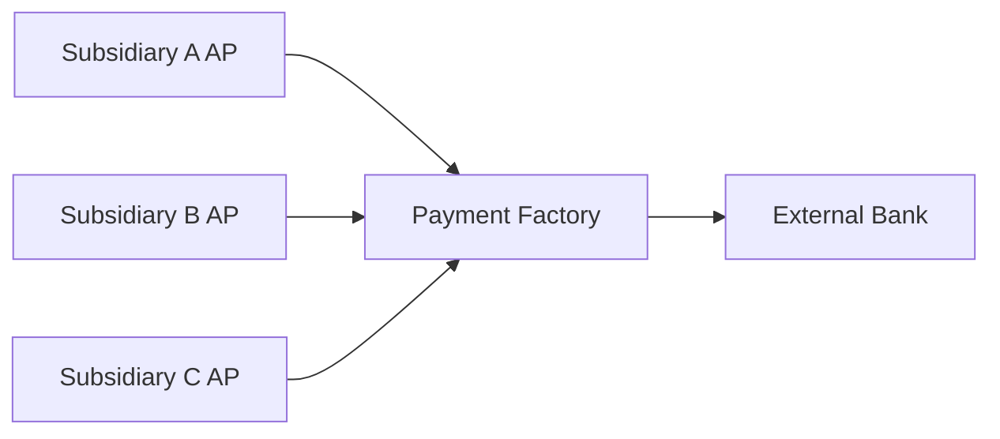
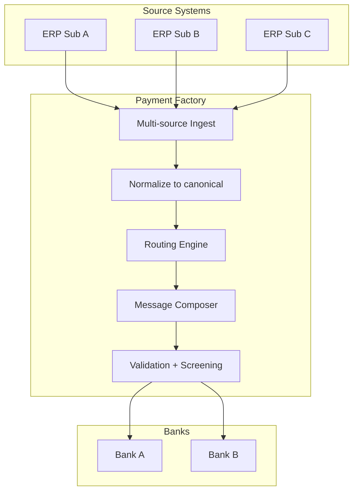

# Payment factory pattern

Centralized payment processing entity (often inside IHB) handling all outbound payments for the group.

## Pattern: Payments On Behalf Of (POBO)

- Sub posts AP invoice approved → PF initiates payment from IHB account
- Bank sees one payer (IHB) — external relationship simplified
- Sub's intercompany account debited to settle

## Receipts factory (ROBO)

Same in reverse — IHB receives on behalf of subs, posts internal credit.

## Architecture

## Routing engine

Picks rail + bank per payment based on:

- Destination country + bank
- Currency
- Amount + urgency
- Cost (fee + FX spread)
- Bank relationship strength
- Beneficiary preference (e.g., SCT Inst preferred)

## Vendors

- Kyriba Payments
- Bottomline PTX / PaymentsAdvanced
- FIS Trax
- Volante VolPay
- SAP Multi-Bank Connectivity

## Regulatory considerations

- **POBO is regulated activity in some jurisdictions** — central entity may need money services license
- VAT + transfer pricing implications
- Bank's KYC: who is the legal payer?

## Linked

[[../concepts/payment-factory]] · [[in-house-bank-pattern]] · [[sct-inst-physical-vendor-map]]
