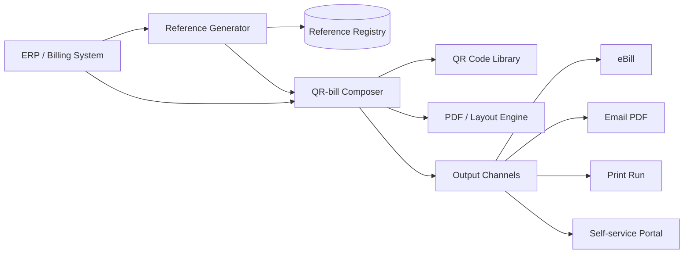

# QR-bill issuance pattern

Architecture for generating QR-bills (PDF + QR code) at biller side.

## Components

## Reference generator

- Owns mod-10 (QRR) or mod-97 (ISO 11649) check digit
- Idempotent: same invoice ID → same reference
- Stored in registry (audit + double-issue prevention)
- Format strategy configurable per creditor (customer-ID-prefixed, sequential, date-encoded)

## Composer

- Consumes invoice + creditor + payer data
- Builds QR payload per [[../data/qr-bill-payload]] spec
- Generates QR PNG / SVG via ZXing / qrcode lib
- Lays out A4 invoice + payment section per SIX style guide
- Output: PDF for digital, print-ready for paper

## Output channels

- **eBill** — push to SIX eBill network with same data ([[../concepts/ebill]])
- **Email PDF** — most common for B2B
- **Print** — physical mail (declining but mandatory for some segments)
- **Self-service portal** — payer pulls from biller's web app

## Validation before issuance

- IBAN validity (per [[../data/reference/iban-validation]])
- IBAN-ref-type compatibility (QR-IBAN ↔ QRR; standard IBAN ↔ SCOR/NON)
- Amount + currency in valid combination
- Address completeness (esp for cross-border ISO 20022 alignment)

## Multi-tenant

- Each biller-corp has own creditor data + reference registry
- Tenant isolation in storage + KMS keys

## Linked

[[ar-reconciliation-pattern]] · [[../data/qr-bill-payload]] · [[../concepts/qr-bill]]
