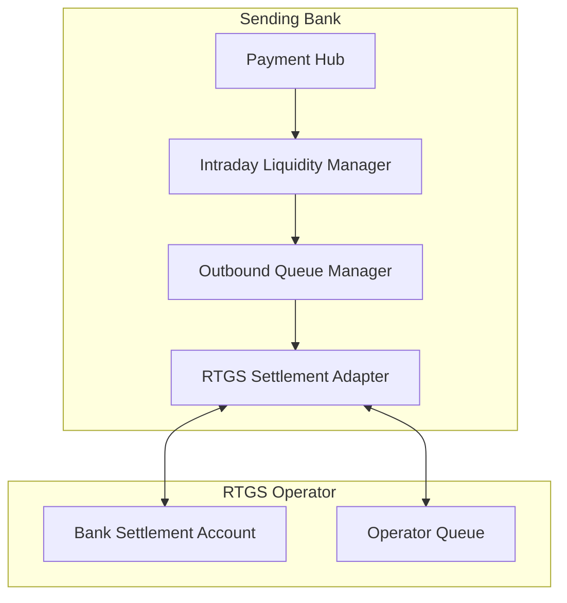

# RTGS settlement pattern

Architecture for direct or indirect RTGS participation across CHF/EUR/GBP.

## Components

## Intraday liquidity manager

- Real-time settlement account position
- Intraday limits: floor (regulatory min reserve), ceiling (collateralized credit cap)
- Auto-funding triggers: pull from sweep account if low
- Receive forecast from incoming (pre-advices, predicted credits)

## Outbound queue manager

- Prioritize by:
  - Customer-mandated time (SttlmTmReq)
  - Time-critical commercial (M&A, settlement legs)
  - Operational (treasury internal)
  - Standard
- Reorder + release as liquidity allows

## Settlement adapter

- Native RTGS protocol per rail (T2 ESMIG, BoE RTGS Renewal, SIC API)
- Maintains session, heartbeats
- Handles operator-side queue management messages (e.g., T2 amend / reorder)

## Direct vs indirect

- **Direct participant**: account at central bank, full liquidity ownership
- **Indirect**: clears via correspondent who is direct participant
- Indirect adds hop, less control over intraday position
- Choice driven by volume + capital + regulatory standing

## Liquidity sources

| Source | Description |
|---|---|
| Reserve balances | Bank's central bank deposit |
| Auto-collateralization | Pre-pledged collateral converts to credit |
| Marginal Lending Facility | Overnight emergency (penal rate) |
| Repo | Intraday liquidity via collateralized borrow |
| Incoming queue | Wait for incoming to cover outgoing |

## Linked

[[../processes/originate-rtgs-wire]] · [[../concepts/sic]] · [[../concepts/t2]] · [[../concepts/chaps]] · [[correspondent-chain-pattern]]
