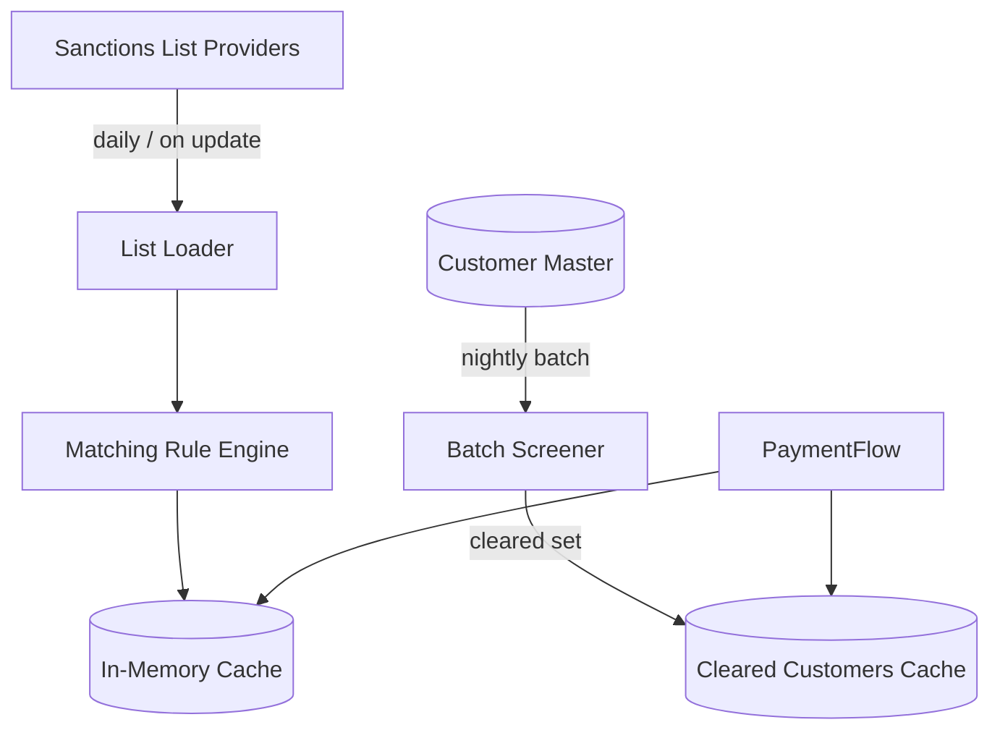

# Sanctions cache pattern

Per-transaction screening too slow for 10s SCT Inst SLA. IPR shifts model — daily customer screening + cached at-tx-time party check.

## Architecture

## Two caches

1. **Cleared customers cache** — set of customer IDs that passed nightly screening
   - Lookup: O(1)
   - Refresh: nightly + on customer change + on sanctions list update
   - Default deny if not in set

2. **Sanctions list cache** — for non-customer parties (beneficiaries on inbound, intermediaries)
   - Loaded at startup, hot-reloaded on list publication
   - Fuzzy matching (Aho-Corasick / Lucene / proprietary)
   - Sub-50ms per lookup

## On list update

- New SDN published (OFAC, EU, SECO, OFSI)
- Re-run customer screening immediately for delta
- Block any new hit, retract cleared status
- Audit log every change

## Failure modes

- Cache stale → screen against in-memory snapshot anyway, alert ops
- New customer not in cache → synchronous screen, slow path
- List publication failure → fall back to last known good, alert

## Compliance considerations

- Regulator expects evidence of frequency + completeness
- IPR (Article 5d) explicitly accepts daily screening for instant flows
- Free-text screening on remittance still happens at tx time (cached patterns)

## Linked

[[../processes/sanctions-screening-flow]] · [[../controls/daily-customer-screening]] · [[../regulations/instant-payments-regulation]]
