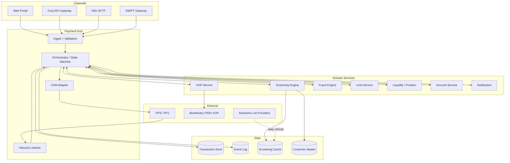

# SCT Inst — logical architecture

Stack-agnostic component model. Each component = capability, not a vendor.

## Container view (C4 L2)

## Component contracts

| Component | Responsibility | Stateful? | SLA |
|---|---|---|---|
| Channel Gateway | Auth, format normalize | No | <500ms |
| Ingest | Schema + duplicate check | No | <200ms |
| Orchestrator | State machine, saga | Yes | <100ms per transition |
| VOP Service | Beneficiary IBAN/name check | No (cache OK) | <2s |
| Screening | Sanctions lookup | Cache | <50ms |
| Fraud | ML scoring | No | <200ms |
| Limit | Entitlement + caps | Yes (counters) | <50ms |
| Liquidity | Reservation + release | Yes | <100ms |
| Account | Credit / debit | Yes | <100ms |
| CSM Adapter | TIPS / RT1 protocol | No (idempotent) | <2s round-trip |
| Notification | Push to corp | No | best-effort |

## Event-driven communication

- **Bus** (Kafka / Solace / RabbitMQ / Pulsar) — at-least-once
- Topics:
  - `payments.received`
  - `payments.validated`
  - `payments.screened`
  - `payments.cleared`
  - `payments.settled`
  - `payments.failed`
- Each event has paymentId + version + correlationId (UETR)
- Idempotent consumers (key by paymentId+version)

## Cross-cutting

- Auth: OIDC + mTLS internal
- Tracing: OpenTelemetry, UETR as trace ID
- Metrics: per-state SLA, per-rail volumes, error rates
- Logs: structured JSON, log-once per state transition

## Linked

[[247-stack-pattern]] · [[sct-inst-physical-vendor-map]] · [[../states/payment-lifecycle]] · [[../processes/originate-sct-inst]]
