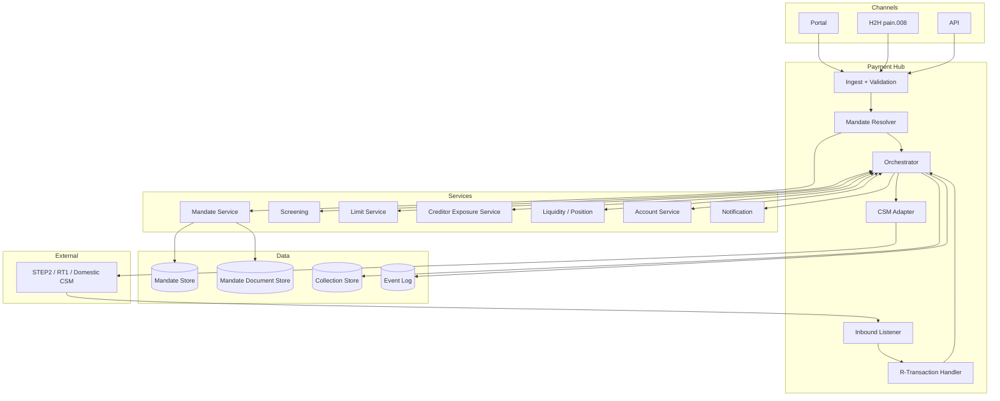

# SDD — logical architecture

Stack-agnostic component model. Reuses [[sct-inst-logical]] core, adds mandate management + R-transaction handling.

## Component delta vs SCT Inst

## New components

| Component | Responsibility |
|---|---|
| Mandate Service | Mandate CRUD, lifecycle state machine, document storage |
| Mandate Resolver | Lookup UMR + CID, validate sequence type vs mandate state |
| Creditor Exposure Service | Track outstanding refund exposure per creditor (8-week window) |
| R-Transaction Handler | Process inbound pacs.004, reverse creditor credit, customer notif |

## Key flows

- **Pre-flight**: pain.008 → Ingest → Mandate Resolver → Orchestrator → CSM (D-1)
- **Settlement**: D → CSM → camt.054 → Orchestrator updates Collection state
- **Return** (D+1 to D+5): pacs.004 → Inbound → R-Transaction Handler → reverse + notify
- **Refund** (D+1 to D+56): pacs.004 with MD06 → R-Transaction Handler → reverse + notify

## Data layer

- **Mandate Store** — OLTP, Mandate entity per [[../data/mandate-entity]]
- **Mandate Document Store** — object store (S3 / GCS) for signed PDFs / e-mandate evidence; KMS encrypted; immutable bucket policy + lifecycle to archive
- **Collection Store** — OLTP, references Mandate; same shape extension as Payment

## Linked

[[../states/mandate-lifecycle]] · [[mandate-management-pattern]] · [[sct-inst-logical]] · [[../data/mandate-entity]]
