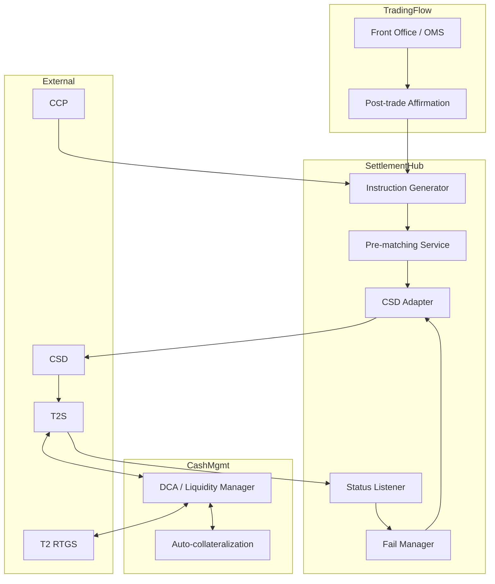

# Securities cash-leg architecture pattern

Components for managing cash-leg of securities settlement.

## Logical view

## Pre-matching service

- Compares own instruction to counterparty's published instruction
- Catches mismatches before CSD-level rejection
- Reduces failure rate
- Vendors: Bloomberg / SmartStream / DTCC ITP

## DCA / liquidity manager

- Per-currency T2S DCA (EUR primarily)
- Real-time position monitoring
- Pre-funding ahead of expected settlement waves
- Receives auto-collateralization credit on shortfall
- EOD: reconcile DCA balance, sweep back to T2 main account

## Fail manager

- Tracks Failed-state instructions
- Calculates accrued [[../concepts/csdr]] penalties
- Triggers retry on position / cash availability
- Reports fail rate + penalty cost to ops
- Liaises with counterparty CSDs for cancellation if needed

## Vendors

| Component | Build | Buy |
|---|---|---|
| Settlement hub | Often build (legacy) | SmartStream, Calypso, Murex post-trade modules |
| Pre-matching | n/a | DTCC ITP (Match), Bloomberg AIM, SmartStream Trade Process |
| DCA management | Often integrated with payment hub | T2S-certified vendors |
| Corp actions | n/a | SmartStream TLM, Broadridge |

## Linked

[[../processes/securities-cash-leg]] · [[../concepts/dvp]] · [[../concepts/t2s]] · [[../concepts/csdr]]
