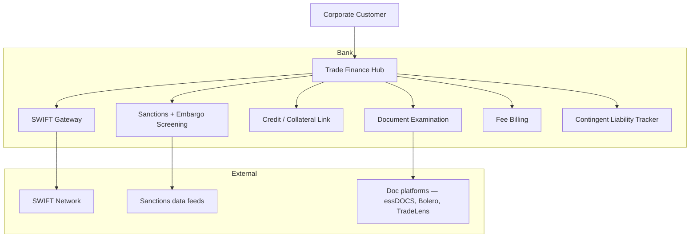

# Trade finance architecture pattern

Components for issuing + servicing LC, BG, SBLC, documentary collections.

## Components

| Component | Responsibility |
|---|---|
| Trade Finance Hub | Lifecycle mgmt for LC / BG / D/C / SBLC |
| Document Examination | OCR + rule-based discrepancy detection, manual review queue |
| Sanctions + Embargo Screening | Multi-list screening on parties + vessels + ports + commodities |
| Credit / Collateral Link | Tie issuance to credit line + collateral usage |
| SWIFT Gateway | MT 7-series messaging |
| Fee Billing | Issuance + amendment + drawing fees |
| Contingent Liability Tracker | Off-balance-sheet exposure reporting |

## Vendors

- **Trade finance platforms**: Surecomp Allnett, Finastra Trade Innovation, CGI Trade360, China Systems Eximbills
- **Document platforms**: essDOCS (electronic BL), Bolero, TradeLens (closed 2023)
- **Sanctions screening**: Fircosoft, Bridger, WorldCheck (covers vessel + dual-use lists)
- **OCR / examination**: Conpend, Surecomp DOC-X

## Integration with cash mgmt

- Drawing payment routes through [[../architecture/correspondent-chain-pattern]] for FX legs
- Settlement on day-of-pay flows via standard rails
- Fee accruals + billing tied to [[../concepts/account-analysis]]

## Linked

[[../concepts/letter-of-credit]] · [[../concepts/bank-guarantee]] · [[../processes/lc-issuance]] · [[../processes/lc-utilization]]
