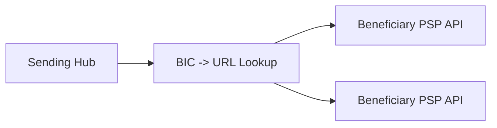
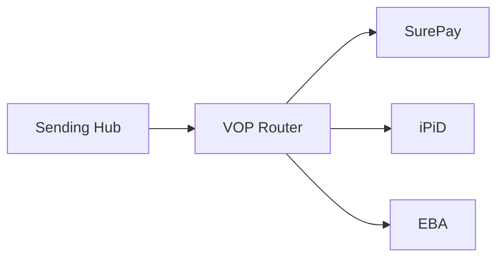

# VOP integration pattern

[[../concepts/vop]] check fits in payment journey before send. Two integration models.

## Direct bilateral



- Each PSP exposes own VOP API
- Sender resolves URL from BIC (directory service)
- N-to-N relationships, no broker

## Routing service



- Centralized router (SurePay, iPiD, EBA Fraud Pattern Detection)
- Single API for sender, router fans out
- Easier ops, vendor lock risk

## Caching

- Names change — short TTL only (24h max recommended)
- Some banks don't cache at all for liability reasons
- Cache key: `(IBAN, name_hash)` → result

## Failure

- Beneficiary PSP timeout → scheme rule: log + proceed (not block)
- Router unavailable → fall back to second router or fail-safe to "not-supported"
- Whole VOP layer down → escalate, may need to halt SCT Inst until restored

## API shape (EPC scheme)

```http
POST /vop/v1/verification
Content-Type: application/json
Authorization: Bearer ...

{
  "iban": "DE89370400440532013000",
  "name": "Acme GmbH",
  "accountTypeHint": "LEGAL"
}

200 OK
{
  "result": "MATCH" | "CLOSE_MATCH" | "NO_MATCH" | "NOT_SUPPORTED",
  "suggestedName": "ACME GmbH"  // close-match only
}
```

## Linked

[[../processes/vop-check-flow]] · [[../concepts/vop]] · [[../controls/vop-control]]
