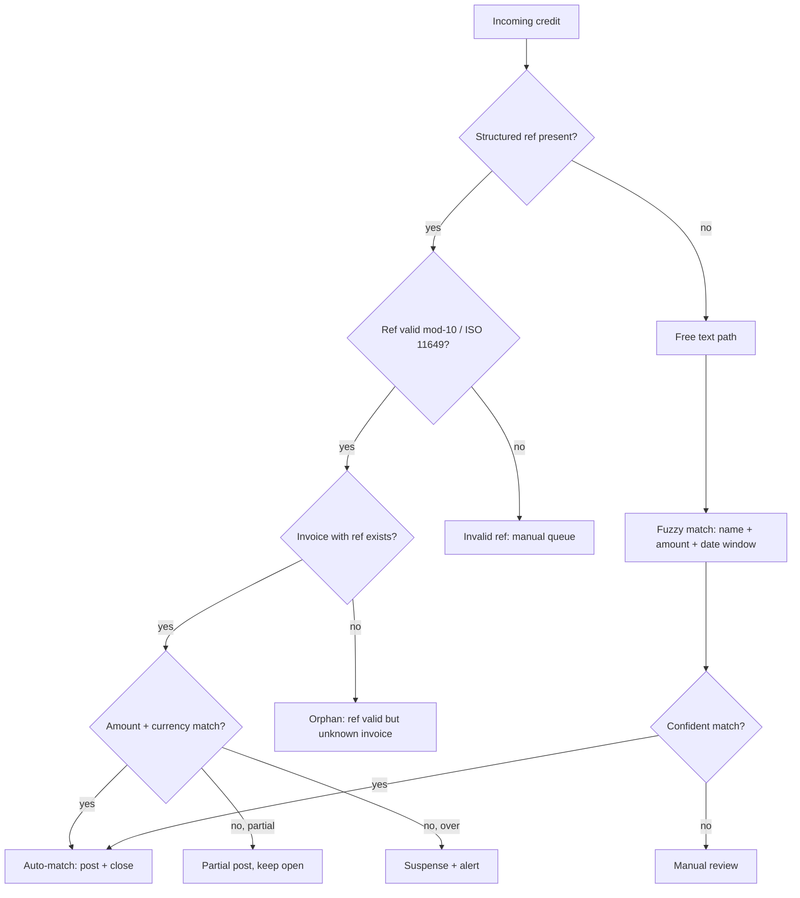

# AR reconciliation — L3 task

Match incoming bank credits to open invoices. Auto where possible, exception queue otherwise.

## Inputs

- Bank statement: camt.054 credit notifications + camt.053 EOD
- Open invoices: AR ledger
- Customer master: payer name → customer ID lookup

## Match algorithm cascade

## Match keys (in priority order)

1. **Structured ref** (highest — 27-digit Swiss or ISO 11649 RF)
2. **Invoice number** in unstructured remittance text
3. **Customer ID** + amount window
4. **Payer name** + amount + date window (fuzzy)

## Confidence scoring (fuzzy match)

| Field | Weight | Notes |
|---|---|---|
| Payer name (Levenshtein) | 0.4 | normalized, case-insensitive |
| Amount exact | 0.3 | binary |
| Date within 5 days | 0.15 | linear decay |
| Customer history | 0.15 | repeat payer signal |

Threshold > 0.85 → auto-match. Else manual.

## Performance targets

- 90%+ auto-match for structured-ref payments
- 60-70% auto-match for free-text (well-tuned)
- Manual queue cleared T+1

## Outputs

- Invoice state transitions (see [[../states/invoice-lifecycle]])
- GL postings (cash side)
- Customer service tickets for unmatched / disputed
- Daily reconciliation report

## Linked

[[qr-bill-receivable]] · [[../architecture/ar-reconciliation-pattern]] · [[../states/invoice-lifecycle]] · [[../data/structured-creditor-reference]]
