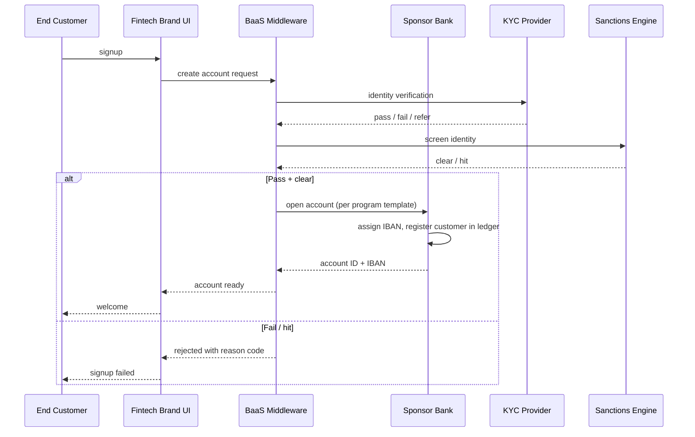

# BaaS customer onboarding — L2

Onboarding end customer of fintech brand into sponsor bank's books.

## Flow

## Bank's responsibilities

- Final KYC sign-off (cannot fully delegate)
- AML risk rating
- Sanctions screening (own engine, not just trust BaaS)
- Reg reporting on aggregate customer base

## Brand's responsibilities

- Customer UX
- Marketing + acquisition
- L1 customer service
- Data sharing per BaaS agreement

## BaaS middleware's responsibilities

- Orchestration between brand + bank
- Common KYC vendor integration
- Customer ledger segregation
- Webhooks + real-time event distribution

## Related

[[../concepts/baas]] · [[../concepts/embedded-finance]] · [[../01-onboarding]]
