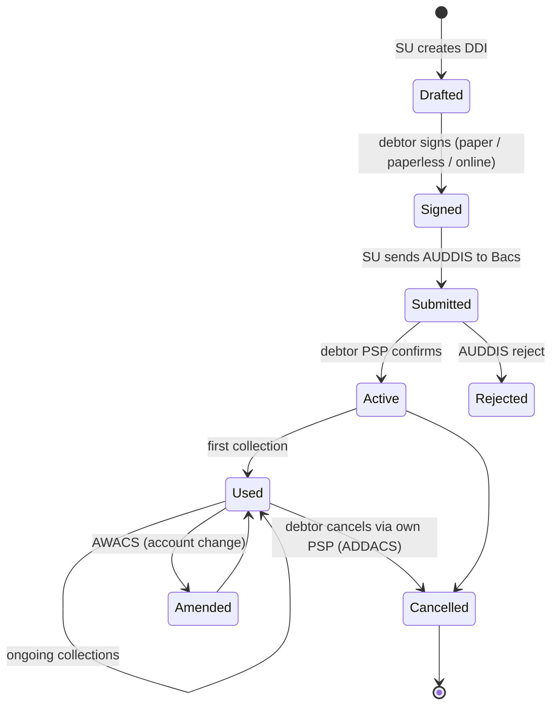

# Bacs DD mandate (DDI) lifecycle — L3

## Lifecycle

## Paperless DDI

- Phone, online, recorded verbal
- Bacs scheme rules dictate verification standards
- Audit trail required (recorded calls, IP/time, etc.)

## Differences vs [[../concepts/sepa-mandate]]

| Aspect | Bacs DDI | SEPA SDD Mandate |
|---|---|---|
| Identifier | None scheme-wide; SU + reference | UMR per CID |
| Confirmation | AUDDIS to debtor PSP | None scheme-wide; B2B requires registration |
| Pre-notification | ≥10 working days | ≥14 days (or agreed) |
| Indemnity | DDG full refund | 8-week (Core), 13m unauthorized |
| Lifecycle storage | SU + (PSP if registered) | Creditor with audit |

## Linked

[[originate-bacs-dd]] · [[../concepts/sepa-mandate]] · [[../states/mandate-lifecycle]]
