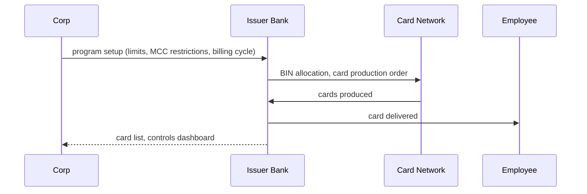
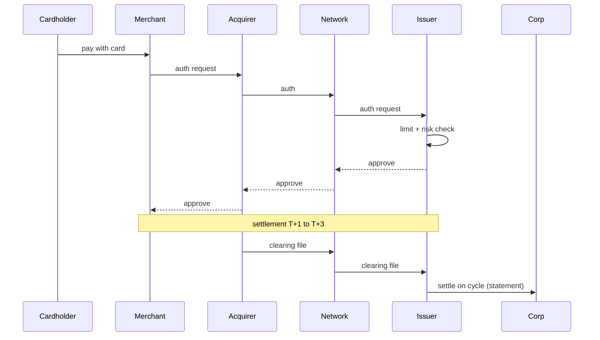

# Commercial card issuance + reconciliation — L2

Per corporate card program: issuance, transaction posting, reconciliation, settlement.

## Issuance flow

## Transaction flow

## Reconciliation

- Daily transaction feed to corp ERP / expense system
- Match: card txn → expense report (T&E) or PO (P-card)
- Level III data (line item) where merchant supports
- Disputed txns: chargeback path via network rules

## Settlement to bank

- Statement cycle (typically monthly or 14-day)
- Direct debit ([[../concepts/sepa-sdd]] / [[../concepts/bacs]]) or wire from corp DDA
- Some programs: real-time auto-debit

## Related

[[../concepts/commercial-card]] · [[../concepts/virtual-card]] · [[../concepts/interchange]]
