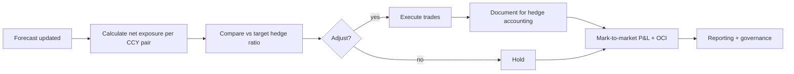

# FX hedging program — L2

Treasury process for hedging foreign currency exposure across the corporate group.

## Inputs

- **Forecast cash flows**: AR / AP per CCY, capex, dividends, intercompany
- **Translation exposure**: foreign subsidiary balance sheets
- **Risk policy**: hedge ratios, instruments allowed, tenors
- **Market data**: rates, volatility, forward curves

## Cycle

## Hedge ratio policy examples

- **Layered**: hedge 100% of next 3M, 75% of months 4-6, 50% of months 7-12
- **Static**: 70% of all expected exposures within 12M
- **Trigger-based**: hedge upon spot crossing threshold

## Instrument selection

- Forwards: cheapest, plain vanilla — most common
- Options: tail-risk + upside retention
- Swaps: combine spot + forward for funding-only flows
- NDFs: non-deliverable currencies

## Execution

- Single-dealer platforms: bank's own portal
- Multi-dealer platforms: 360T, FXall, Bloomberg FXGO
- Algos: execution algorithms for size
- Best execution under [[../regulations/mifid-ii]]

## Hedge accounting

- Designation at trade inception
- Effectiveness testing per cycle
- Documentation in TMS / specialty tool

## Related

[[../concepts/fx-spot]] · [[../concepts/fx-forward]] · [[../concepts/hedge-accounting]] · [[../architecture/fx-treasury-pattern]]
