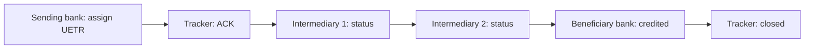

# gpi tracking — L3 task

SWIFT global payments innovation (gpi) provides end-to-end transparency on cross-border wires via UETR.

## Concept

- Every gpi payment carries unique UETR (UUID)
- All banks in chain post status updates to SWIFT gpi tracker
- Originator + beneficiary can query status by UETR
- Replaces opaque MT103 (which lost visibility once it left sending bank)

## UETR lifecycle

## Status types posted to tracker

- Accepted (Cred) — settled to next bank
- Charged (Chrg) — fee deducted
- Pending (Pdng) — held for review
- Rejected (Rjct) — leg failed
- Investigation — manual ops involved
- Confirmed credit — beneficiary credited

## Querying

- Bank API to gpi tracker: `GET /payments/{uetr}/status`
- Returns full chain history + next-hop status
- Some banks expose tracker passthrough to corporate via [[../concepts/api]]

## Service levels (gpi commitments)

- 100% same-day reach (where cutoffs allow)
- 50% credited within 30 min
- 100% credited within 24 hours
- Full transparency on charges + FX

## Adjacent: SWIFT pre-validation

- Optional pre-flight: validate beneficiary IBAN/BIC + name against beneficiary bank before send
- Reduces repair rates
- Embedded in gpi product family

## Use case for corporates

- Track high-value outgoing wires in real-time
- Customer service can answer "where is my payment?" with concrete status
- Auto-update ERP/TMS via tracker API integration

## Linked

[[originate-cross-border-wire]] · [[../concepts/swift]] · [[../concepts/iso-20022]] · [[../runbooks/wire-investigation]]
