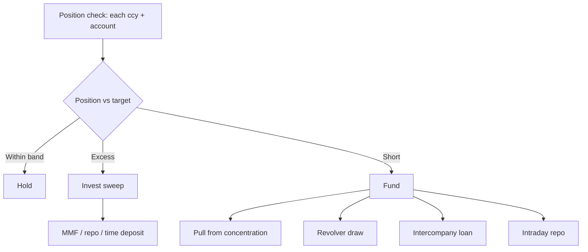

# Intraday liquidity management — L2

How treasury manages cash position throughout the day across multiple banks + currencies + rails.

## Inputs

- Real-time balances (camt.052 polling, [[../concepts/api]])
- Pre-advised receipts
- Outgoing payment queue
- FX positions
- Credit lines / facility availability

## Position calculation

```
Position(t, ccy, account) =
   Opening balance
 + ∑ confirmed credits (camt.054) up to t
 + ∑ pre-advised credits expected by EOD
 - ∑ confirmed debits up to t
 - ∑ scheduled outgoing payments
```

## Decisions per pacing window



## Core concepts

- **Concentration** — pool subsidiary balances to master via [[../concepts/zba]] / [[../concepts/sweep]]
- **Pre-funding** — predict + fund settlement accounts ahead of large outgoings
- **Buffer** — minimum operational reserve per account
- **Cutoff awareness** — stage funding ahead of rail cutoffs

## In-house bank model

Large multi-entity corp pools liquidity in central treasury entity:

- Subsidiaries' bank accounts swept daily to in-house bank ledger
- Inter-company transactions netted internally (no external bank cost)
- External bank accounts minimized
- Tax + transfer-pricing implications (must be at arm's length)

## Linked

[[sweep-orchestration]] · [[../concepts/sweep]] · [[../concepts/zba]] · [[../concepts/intraday-liquidity]] · [[../architecture/in-house-bank-pattern]]
