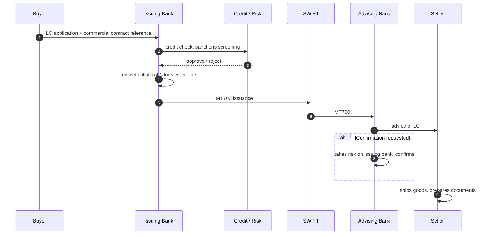

# LC issuance — L2

End-to-end flow for issuing a documentary letter of credit.

## Sequence

## Pre-issuance checks

- Buyer credit line + collateral
- Sanctions screening on all parties (incl beneficiary, applicant, vessel, ports)
- Country risk (issuing bank country, advising bank country, beneficiary country)
- Sensitive goods check (dual-use, weapons, embargoed)
- KYC on applicant + (where possible) beneficiary

## Linked

[[lc-utilization]] · [[../concepts/letter-of-credit]] · [[../concepts/ucp-600]] · [[../concepts/swift-mt-7xx]]
