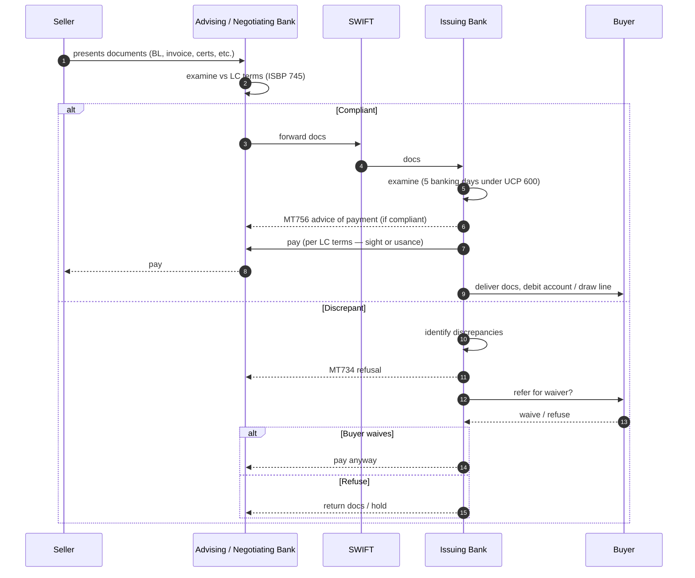

# LC utilization (drawing) — L2

Seller presents documents, banks examine, payment flows.

## Sequence

## Discrepancy handling

- Common: late shipment, late presentation, missing endorsement, inconsistent data
- Issuing bank gives single notice with all discrepancies (UCP 600 art 16)
- Buyer may waive — pragmatic resolution
- If unwaived: docs returned to seller (still has goods, must find alt buyer)

## Cash leg

- Sight LC: pay on compliant presentation
- Usance LC: pay at maturity (90/180/360 days from acceptance)
- Issuing bank may discount usance bills (early pay seller, charge buyer at maturity)

## Linked

[[lc-issuance]] · [[../concepts/letter-of-credit]] · [[../concepts/ucp-600]]
