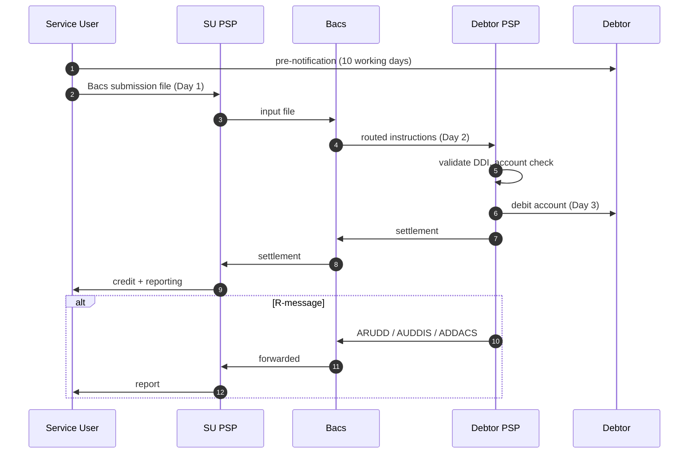

# Originate Bacs Direct Debit — L2

UK direct debit collection. Differs from [[../concepts/sepa-sdd]] in cycle, mandate format, indemnity model.

## Cycle

3-day Bacs cycle:

| Day | Action |
|---|---|
| Day 1 (input) | Service User submits payment instructions to Bacs |
| Day 2 (processing) | Bacs distributes to PSPs |
| Day 3 (entry) | Funds debited at debtor account, credited at Service User |

Submission cutoff ~10:30 GMT.

## Pre-collection

- Service User onboarding via PSP — gets SUN (Service User Number)
- Mandate (DDI — Direct Debit Instruction) signed by debtor (paper, online, paperless)
- AUDDIS (Automated DDI) — DDI sent to debtor PSP for confirmation
- Pre-notification (advance notice) ≥10 working days unless agreed (much longer than SEPA D-1)

## Sequence

## Bacs message types

| Type | Purpose |
|---|---|
| AUDDIS | New / amended DDI advice to PSPs |
| ADDACS | DDI cancellation / amendment by debtor |
| ARUDD | Unpaid (insufficient funds, account closed, etc.) |
| AWACS | Advice of Amendment of Customer Account Set |
| DDIC | Direct Debit Indemnity Claim — debtor invokes DDG |

## Direct Debit Guarantee (DDG)

- UK consumer protection scheme
- Indemnity refund without question for unauthorized / incorrect collections
- Service User carries liability — refund taken back from SU's PSP
- DDIC message used to invoke claim
- Contrast with SDD: DDG is industry-funded indemnity at all times; SDD has 8-week refund (Core)

## Branch points

- Mandate not active at debtor PSP → ARUDD return
- Insufficient funds → ARUDD R-code (similar to AC04/AM04)
- Debtor cancels via own bank → ADDACS, future collections rejected
- DDG claim raised → DDIC, refund mandatory

## Linked

[[../concepts/bacs]] · [[bacs-dd-mandate-lifecycle]] · [[bacs-r-messages]] · [[../states/mandate-lifecycle]]
