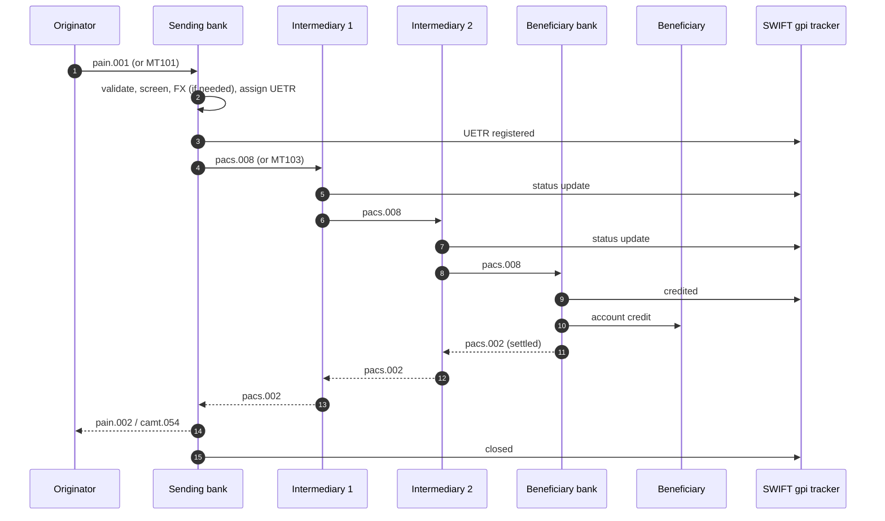

# Originate cross-border wire — L2

End-to-end cross-border SWIFT credit transfer. CHF/EUR/GBP outbound to any global counterparty. Different from domestic [[../concepts/wire]] — multi-bank correspondent chain.

## Actors

- **Originator** (corp customer) — initiates
- **Sending bank** (originator's bank) — debits originator
- **Intermediary banks** (correspondent chain) — 0-3 hops
- **Beneficiary bank** — credits beneficiary
- **CLS / nostro / vostro** layer — currency settlement
- **gpi tracker** — UETR-based tracking layer

## Sequence

## Currency settlement layer (parallel to messaging)

- Each leg between banks settles via correspondent account (nostro at next bank's books)
- Major USD chain: most non-US banks settle USD via JPM Chase / Citi / BNY / BofA (the big USD correspondents)
- EUR chain: T2 if both EU, else correspondent
- CHF chain: SIC if both CH, else correspondent
- FX leg: handled at sending or intermediary depending on payment instructions (charge bearer)

## CBPR+ (ISO 20022 cross-border)

- SWIFT cross-border traffic migrating to MX (pacs.008.001.10) by Nov 2025
- New mandatory fields: structured address (town, country), LEI, structured remittance
- Coexistence period 2023-2025: CBPR+ MX can be sent, banks must convert to MT for non-MX-ready receivers (Translation responsibility)
- After Nov 2025: MT103 cross-border retired

## Charge bearer

| Code | Meaning |
|---|---|
| OUR | Originator pays all charges |
| BEN | Beneficiary pays all charges |
| SHA | Shared (originator pays sending bank, beneficiary pays rest) |

For SEPA: SLEV only.

## Branch points

- Sanctions hit at any leg → block, payment held by that bank
- Bad beneficiary info → manual repair at intermediary or BBank, may delay days
- FX rate dispute → SBank applies pre-disclosed rate
- Compliance queries (KYC/source of funds) by intermediaries → ETA delays

## Latency

- Same-day: only if all parties + cutoffs aligned (often ≤1 hop, major currency)
- Typical: 1-3 business days
- gpi commitment: 50% of gpi payments credited within 30 minutes, 100% within 24 hours (gpi service level)

## Linked

[[gpi-tracking]] · [[../concepts/swift]] · [[../concepts/iso-20022]] · [[../states/cross-border-wire-lifecycle]] · [[../data/pacs-008-cbpr-fields]]
