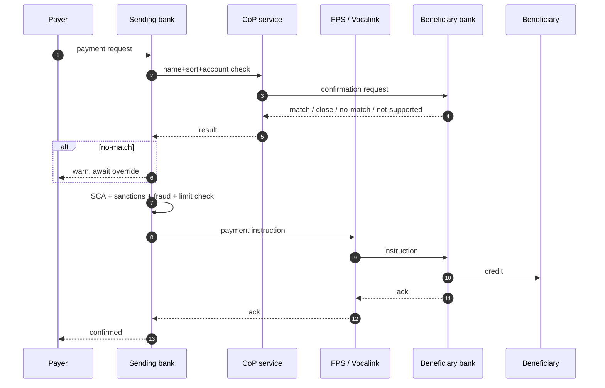

# Originate Faster Payments (FPS) — L2

UK instant credit transfer. ≤2 hours guaranteed (typically <seconds), 24/7/365, ≤£1M limit.

## Sequence

## Differences vs SCT Inst

| Aspect | FPS | SCT Inst |
|---|---|---|
| Currency | GBP | EUR |
| Limit | £1M | No scheme cap (PSP discretion) |
| SLA | ≤2 hours guaranteed | ≤10s |
| Pre-validation | [[../concepts/cop]] | [[../concepts/vop]] |
| Settlement | Multi-cycle deferred net (currently); NPA target real-time gross | Real-time gross via TIPS / RT1 |
| Format | FPS proprietary (NPA migration to ISO 20022 pending) | ISO 20022 native |

## NPA migration

- New Payments Architecture replaces FPS + Bacs over multi-year plan
- ISO 20022 native, real-time gross settlement
- Repeatedly delayed; live timeline TBD
- Banks should plan for ISO 20022 message flows in parallel

## CoP (Confirmation of Payee)

See [[../concepts/cop]]. Mandatory for FPS payments. Phase 2 (2023) extended coverage to all PSPs holding consumer accounts.

## Branch points

- CoP no-match → payer override required (liability shifts)
- Sanctions hit → reject (cannot resolve in 2h SLA reasonably)
- Limit breach (≥£1M) → fall back to [[../concepts/chaps]]
- Beneficiary bank declines → return

## Use cases

- Consumer P2P (most volume)
- Salary advance / earned wage access
- B2B small-value (< £1M)
- Top-ups, e-commerce instant

## Linked

[[../concepts/fps]] · [[../concepts/cop]] · [[../states/payment-lifecycle]] · [[originate-sct-inst]]
