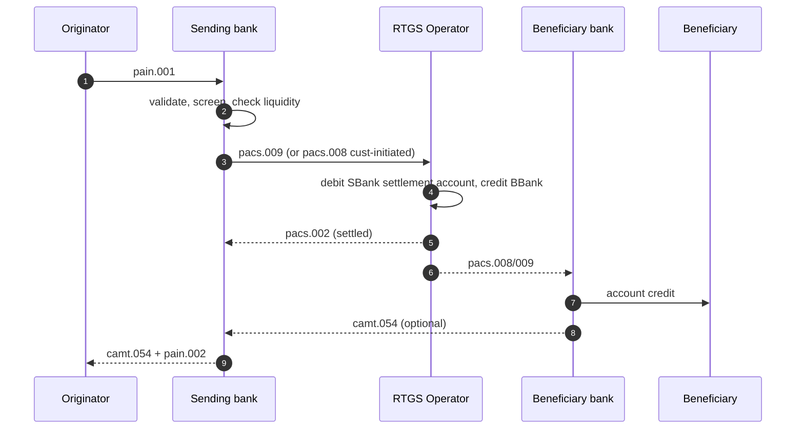

# Originate RTGS wire (CHAPS / T2 / SIC) — L2

End-to-end domestic high-value RTGS wire. CHF via [[../concepts/sic]], EUR via [[../concepts/t2]], GBP via [[../concepts/chaps]]. Single-leg settlement in central bank money.

## Actors

- **Originator** — corp customer
- **Sending bank** — direct or indirect RTGS participant
- **RTGS operator** — SNB/SIX, Eurosystem (ECB), BoE
- **Beneficiary bank** — same currency, direct or indirect participant

## Key property

- **Direct settlement in central bank money** — no correspondent chain (same-currency domestic)
- Final + irrevocable on settlement
- Per-payment (gross) — not netted
- Single CSM hop

## Sequence

## Liquidity

- Direct participants hold settlement account at central bank
- Intraday liquidity from:
  - Reserve balances
  - Collateralized intraday credit (SNB Lombard, ECB MRO collateral, BoE Reserves Account)
  - Incoming receipts (queue management)
- Bank monitors position real-time, intraday MT942/camt.052

## Cutoffs

| Rail | Cutoff |
|---|---|
| [[../concepts/sic]] retail | ~15:00 CET |
| [[../concepts/sic]] bank-to-bank | ~16:15 CET |
| [[../concepts/t2]] customer | 17:00 CET |
| [[../concepts/t2]] interbank | 18:00 CET |
| [[../concepts/chaps]] customer | 17:40 GMT |
| [[../concepts/chaps]] interbank | 18:00 GMT |

## Indirect access

- Smaller banks settle via correspondent who is direct participant
- Adds hop, may delay
- Common in CH (cantonal banks via UBS / PostFinance for some flows)

## Branch points

- Insufficient liquidity → queue at RTGS until incoming covers (or rejected)
- Sanctions hit → blocked at sending bank, never released
- Bad beneficiary detail → repair queue at beneficiary bank, possible return

## Linked

[[../concepts/wire]] · [[../concepts/sic]] · [[../concepts/t2]] · [[../concepts/chaps]] · [[../states/rtgs-wire-lifecycle]] · [[../data/pacs-009-fields]]
