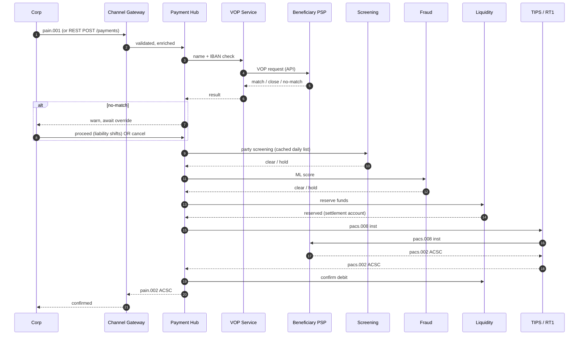

# Originate SCT Inst — L2

End-to-end send flow at sending PSP. Target: <10s end-to-end per [[../concepts/sct-inst]].

## Actors

- **Corporate** (originator) — initiates via ERP / TMS / portal / API
- **Payment Hub** at sending PSP
- **VOP service** (sending PSP side)
- **Beneficiary PSP** VOP service
- **Screening engine** (sending PSP)
- **Fraud engine** (sending PSP)
- **Liquidity / position keeper**
- **Clearing infrastructure** ([[../concepts/tips]] or [[../concepts/eba-rt1]])
- **Beneficiary PSP** payment hub

## Sequence (happy path)

## Latency budget (10s SLA)

| Step | Target |
|---|---|
| Channel ingest + validate | 200ms |
| VOP round-trip | 1500ms |
| Sanctions (cached) | 50ms |
| Fraud ML score | 200ms |
| Liquidity reserve | 100ms |
| CSM round-trip ([[../concepts/tips]]) | 2000ms |
| Beneficiary PSP processing | 3000ms |
| Confirmation back | 1000ms |
| **Buffer** | 1950ms |

Real systems aim p95 well under 10s. Reject if budget breach detected mid-flow.

## Branch points

- VOP no-match → user override or cancel
- Sanctions hit → block, manual review (cannot resolve in 10s SLA)
- Fraud high score → block or step-up auth
- Liquidity insufficient → reject
- CSM timeout → see [[../runbooks/timeout-handling]]

## States produced

See [[../states/payment-lifecycle]].

## Linked

[[../concepts/sct-inst]] · [[../concepts/vop]] · [[../architecture/sct-inst-logical]] · [[../controls/sct-inst-control-catalog]]
