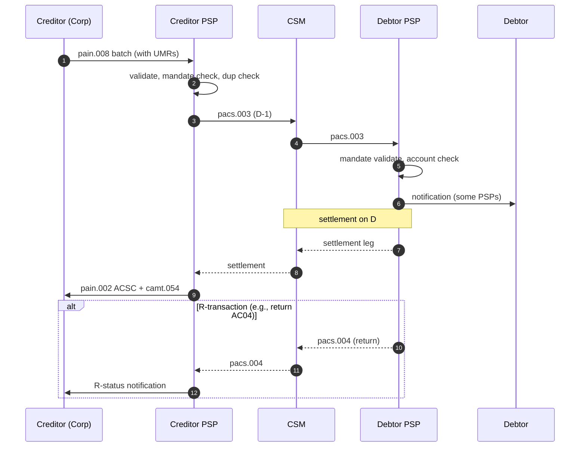

# Originate SDD — L2

End-to-end SEPA Direct Debit collection at creditor PSP. See [[../concepts/sepa-sdd]].

## Actors

- **Creditor** (corporate) — submits collection batch
- **Creditor PSP** (CDTR PSP) — initiates pacs.003
- **CSM** ([[../concepts/eba-step2]] or domestic, batch processor)
- **Debtor PSP** (DBTR PSP) — debits debtor account
- **Debtor** — refund right under [[../regulations/amld-amlr-amla]] consumer protection (Core only)

## Variants

| Variant | First collection lead time | Recurring lead time | Refund right |
|---|---|---|---|
| SDD Core | D-1 (post-2016 reforms) | D-1 | 8 weeks no-questions, 13 months unauthorized |
| SDD B2B | D-1 | D-1 | None (debtor must approve mandate at own PSP) |

## Sequence (Core, recurrent)

## Pre-flight checks at creditor PSP

- Mandate exists, valid, signed-by-debtor
- UMR unique per (CID, debtor)
- Sequence type correct (FRST first time, RCUR recurring, OOFF one-off, FNAL final)
- Pre-notification date respected (≥14 days unless agreed otherwise)
- Debtor's IBAN reachable for SDD
- Creditor's CID active

## Branch points

- Mandate not found → reject before submission
- Sequence mismatch → reject (debtor PSP returns AM05 / MD06)
- Account closed at debtor → return AC04
- Refused by debtor (instructed bank not to pay) → return MS02 / MD01

## States produced

See [[../states/payment-lifecycle]] (collection side) + [[../states/mandate-lifecycle]] (mandate side).

## Linked

[[../concepts/sepa-sdd]] · [[../concepts/sepa-mandate]] · [[sdd-mandate-lifecycle]] · [[sdd-r-transactions]] · [[../data/mandate-entity]]
