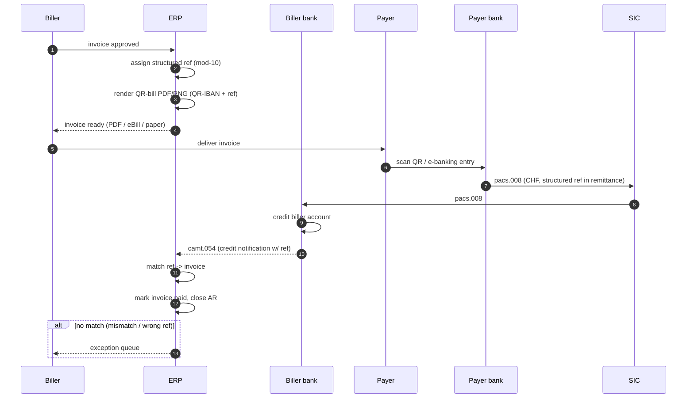

# QR-bill receivable — L2

End-to-end Swiss invoicing + receivable lifecycle. Different pattern from payment origination — corp is **receiving**, not sending.

See [[../concepts/qr-bill]], [[../concepts/qr-iban]].

## Actors

- **Biller** (corporate creditor) — issues invoice
- **Biller's bank** — provides QR-IBAN, posts incoming credits
- **Payer** — receives invoice, pays
- **Payer's bank** — initiates [[../concepts/sic]] credit transfer
- **AR system** at biller — reconciles payment to invoice

## Sequence

## Per-invoice lifecycle

- Invoice created with unique structured creditor reference
- Reference embedded in QR code + payment slip section
- Reference travels with payment via `RmtInf/Strd/CdtrRefInf/Ref`
- Bank statement (camt.054) carries reference back
- AR engine matches reference → invoice ID

## Why structured reference >> free text

- Free text remittance: lossy, manual matching, OCR errors
- Structured ref (mod-10 27-digit Swiss or ISO 11649 RF): deterministic match
- See [[../data/structured-creditor-reference]]

## QR-IBAN vs standard IBAN

- **QR-IBAN** (IID 30000-31999): mandatory structured ref required
- **Standard IBAN**: free-text remittance allowed
- Bank validates ref-IBAN combo at payment initiation
- Some Swiss banks issue both per legal entity

## Reconciliation outcomes

| Match type | Action |
|---|---|
| Exact (ref + amount + currency) | Auto-post, close invoice |
| Ref match, amount mismatch (under) | Partial pay, keep invoice open with balance |
| Ref match, amount mismatch (over) | Overpay → suspense, customer service |
| No ref (free-text payment to standard IBAN) | Fuzzy match (name, amount, date) → manual queue if uncertain |
| Wrong ref | Manual review queue |

## Connection to receivables stack

- Replaces [[../concepts/lockbox]] (paper) and OCR'd remittance
- Often paired with [[../concepts/virtual-accounts]] for high-volume billers
- [[../concepts/ebill]] = e-invoicing variant carrying same reference data digitally

## Linked

[[ar-reconciliation]] · [[../concepts/qr-bill]] · [[../concepts/qr-iban]] · [[../states/invoice-lifecycle]] · [[../data/invoice-entity]]
