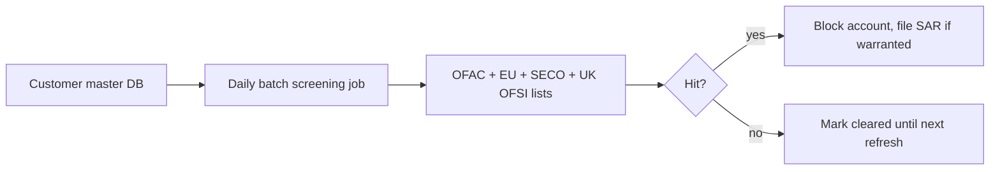
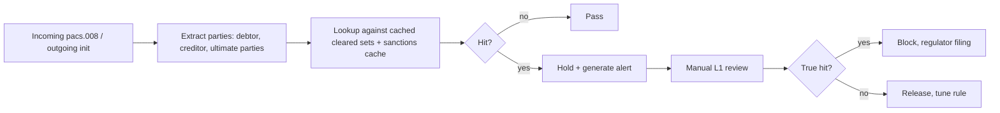

# Sanctions Screening — L3 task

Two layers under IPR for instant rails: **daily customer screening** + **transaction-time party screening (cached lists)**.

## Daily customer screening

- Runs daily (or on list publication trigger)
- Catches sanctioned customers regardless of payment activity
- Replaces per-transaction screening for instant payments under IPR
- Outputs: cleared customer set used at transaction time

## Transaction-time screening

- Cached lists, in-memory lookup, sub-50ms
- For SCT Inst — only checks parties + free-text fields for residual risk
- True hits cannot be resolved in 10s — payment rejected, manual after

## Lists screened

- OFAC SDN + sectoral
- EU consolidated list
- SECO (CH)
- UK OFSI
- UN sanctions
- PEP lists (separate workflow, not blocking)

## Hit handling

- 50% rule: entity ≥50% owned by sanctioned party also blocked
- Partial-name fuzzy match → false positive tuning critical
- All hits logged, audit trail per [[../regulations/amld-amlr-amla]]

## Linked

[[../concepts/ofac]] · [[../controls/daily-customer-screening]] · [[../runbooks/sanctions-hit-handling]] · [[../architecture/sanctions-cache-pattern]]
