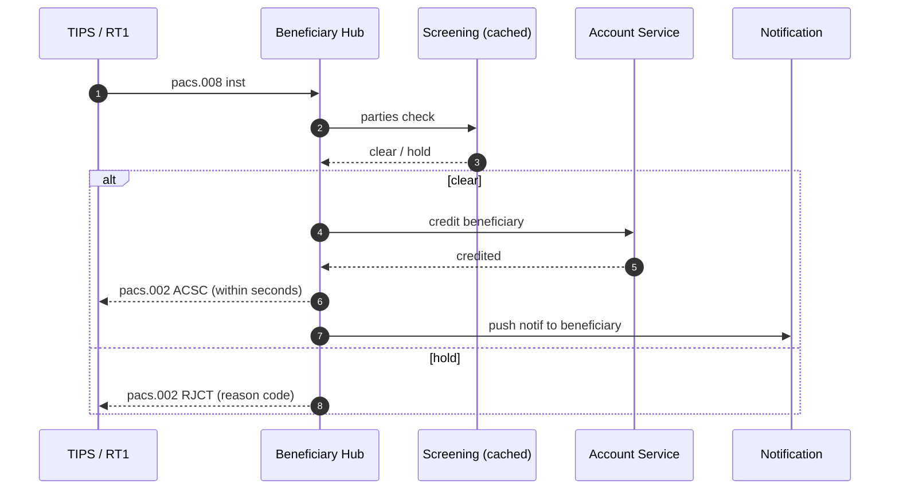

# Receive SCT Inst — L2

Receive-side at beneficiary PSP. Mandatory under [[../regulations/instant-payments-regulation]] from Jan 9 2025.

## Sequence

## Constraints

- Must respond within 10s or rail rejects
- Sanctions hit → reject (no manual review fits in budget)
- Account closed / not found → reject (AC04 / AC03 equivalent)
- Account credit confirmed BEFORE pacs.002 sent — bank takes credit risk on internal flush

## Reject reasons (subset of pacs.002 reason codes)

| Code | Meaning |
|---|---|
| AC01 | Incorrect account number |
| AC04 | Closed account |
| AC06 | Blocked account |
| AG01 | Transaction forbidden |
| AM04 | Insufficient funds (rare on receive — only fee accounts) |
| BE05 | Unrecognized initiating party |
| FF05 | Reason not specified |
| RR01 | Regulatory reason |

## Linked

[[originate-sct-inst]] · [[sanctions-screening-flow]] · [[../states/payment-lifecycle]]
