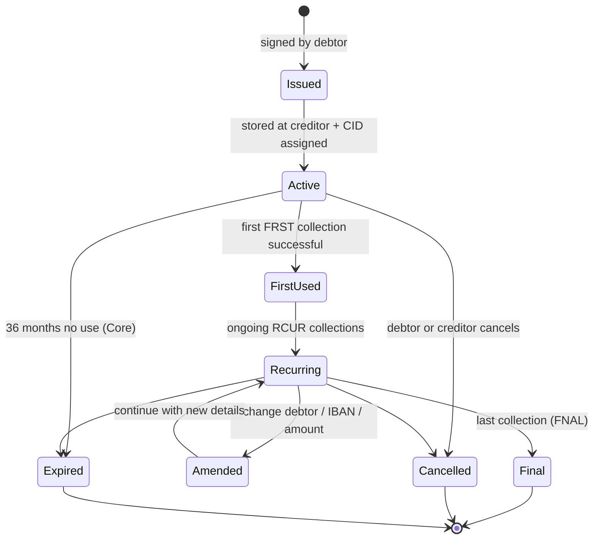

# SDD Mandate Lifecycle — L3

Authorization document state machine. Without valid mandate, debit unauthorized → automatic refund right.

## States

## Lifecycle events

| Event | Trigger | Side effects |
|---|---|---|
| Issue | Debtor signs mandate (paper, e-mandate, or e-banking) | Stored, UMR assigned, indexed |
| Activate | First storage by creditor | Available for collections |
| First use | First FRST collection | Sequence flips to RCUR |
| Amend | Change to debtor name / IBAN / creditor / amount range | Logged, may require re-confirm depending on change scope |
| Cancel | Debtor revokes via own PSP, or creditor closes | Cannot be used again |
| Expire | 36 months inactivity (Core) | Auto-cancelled |
| Final | Creditor sends FNAL — last collection | Mandate retired post-settlement |

## Storage requirements

- Original signed mandate (scan or e-mandate evidence)
- All amendments + audit trail
- Retention: during life + audit period (typically 14 months post last use; longer per local AML rules)

## E-mandate path

- e-Mandate scheme via online banking auth
- Tech: secure messaging between creditor's bank and debtor's bank
- Limited adoption — most creditors use scanned PDF + signed paper

## Linked

[[../concepts/sepa-mandate]] · [[originate-sdd]] · [[../states/mandate-lifecycle]] · [[../data/mandate-entity]] · [[../controls/sct-inst-control-catalog]]

## On-chain equivalent

See [`paycodex-onchain` use case 014 — Direct debit mandate](https://github.com/lopezpalacios/paycodex-onchain/blob/main/use-cases/014-direct-debit-mandate.md). Runnable contract in [`paycodex-factory/contracts/14-direct-debit-mandate.sol`](https://github.com/lopezpalacios/paycodex-factory/blob/main/contracts/14-direct-debit-mandate.sol). Mandate state machine + interval enforcement runs on-chain. Note: no equivalent of 8-week refund right — needs off-chain dispute layer.
