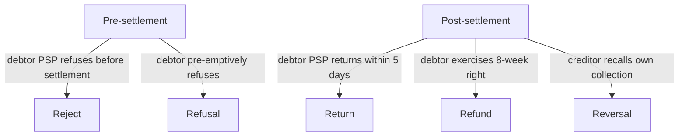
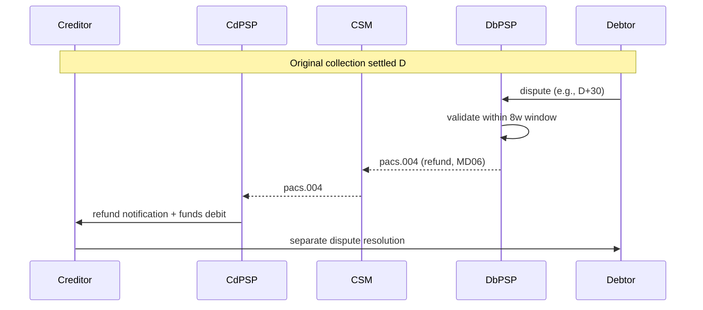

# SDD R-transactions — L3

Lifecycle exceptions: Reject / Refusal / Refund / Return / Reversal. Each has distinct timing, sender, and reason space.

## Five Rs

## Timing

| Type | Window | Initiator | Reason space |
|---|---|---|---|
| Reject | Before settlement | Debtor PSP | Technical / format / mandate |
| Refusal | Before settlement | Debtor (via own PSP) | Customer instruction |
| Return | ≤5 banking days post-settlement | Debtor PSP | Account closed / blocked / NSF |
| Refund | 8 weeks (Core) | Debtor (via own PSP) | No questions asked (Core) |
| Reversal | Up to 5 days | Creditor | Mistake corrections |
| Unauthorized refund | 13 months | Debtor | Disputed authorization |

## Common R-codes (subset)

| Code | Meaning | Type |
|---|---|---|
| AC01 | Incorrect account number | Reject/Return |
| AC04 | Closed account | Return |
| AC06 | Blocked account | Return |
| AG01 | Transaction forbidden | Reject |
| AG02 | Bank operation code invalid | Reject |
| AM04 | Insufficient funds | Return |
| AM05 | Duplicate | Reject |
| BE05 | Unrecognized initiating party / CID | Reject |
| MD01 | No mandate | Refund |
| MD02 | Missing mandatory information | Reject |
| MD06 | Refund per debtor | Refund |
| MD07 | End customer deceased | Return |
| MS02 | Not specified by customer | Refund |
| MS03 | Not specified | Refund |
| RR01 | Regulatory reason | Reject/Return |
| SL01 | Specific service offered by debtor agent | Reject |

Full catalog: ISO 20022 ExternalReturnReason1Code list.

## Tech / message types

- Pre-settlement reject: pacs.002 (status report)
- Return: pacs.004 (Payment Return)
- Refund: pacs.004 with refund-specific reason
- Reversal: pacs.007 (Customer Payment Reversal) / pacs.004 (FI Reversal)

## Process

## Creditor exposure

- Creditor PSP debits creditor account on refund
- Creditor pursues debtor outside payment system
- Hence: SDD is risk product for creditor — credit limit set on collection volume

## Linked

[[originate-sdd]] · [[../concepts/sepa-sdd]] · [[../runbooks/r-transaction-handling]] · [[../data/r-transaction-codes]]
