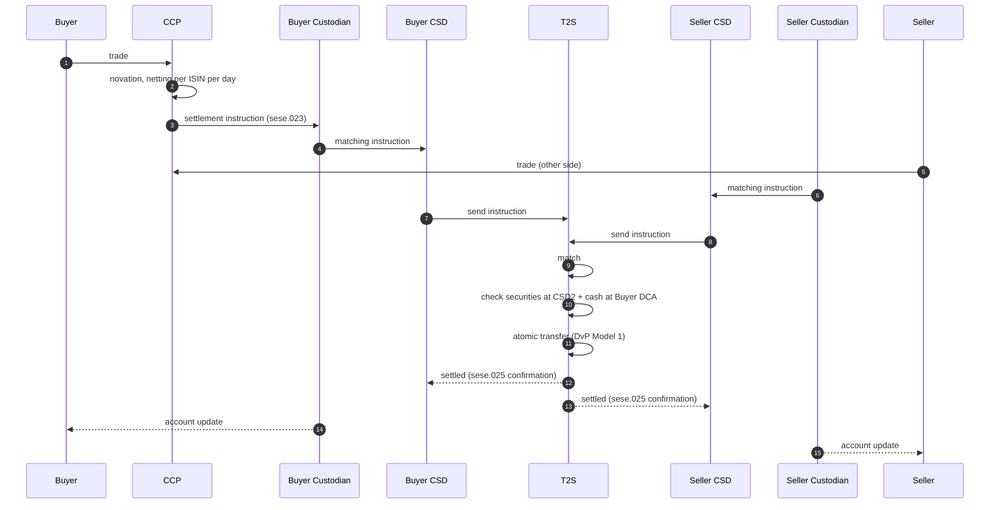

# Securities settlement cash leg — L2

DvP settlement via T2S (EUR), SIC (CHF), CREST/CHAPS (GBP). Cash leg of every trade settlement.

## Actors

- **Trading parties** — buyer, seller (or their custodians / brokers)
- **CSDs** — [[../operators/euroclear]] / [[../operators/clearstream]] / SIX SIS / CREST
- **CCP** (if cleared) — Eurex Clearing, LCH, Cboe Clear
- **T2S** — settlement platform for EUR
- **Cash accounts** — DCA at NCB (T2S) or operating account (other rails)

## Sequence (T2S DvP Model 1, cleared)

## Cash leg specifics

- Buyer's DCA debited
- Seller's (or CCP's) DCA credited
- Both legs simultaneous
- Auto-collateralization fires if buyer DCA short (pre-pledged securities convert to credit)

## Pre-settlement checks

- Securities position at seller CSD ≥ trade qty
- Cash position at buyer DCA ≥ trade value (or auto-coll capacity)
- Matching: trade details agree both sides
- Mandatory data: ISIN, qty, value, settlement date, parties, place of settlement

## Failure modes

- **No matching counterparty instruction** — trade unmatched, cannot settle
- **Insufficient securities** — seller fail
- **Insufficient cash** — buyer fail (rare with auto-coll)
- **Bilateral cancellation**

## CSDR cash penalties

- Daily penalty on failing party until settled
- See [[../concepts/csdr]]

## T+1 transition

- US T+1 since May 2024
- EU T+1 target Oct 2027
- Squeezes pre-matching, FX, funding workflow

## Linked

[[../concepts/dvp]] · [[../concepts/t2s]] · [[../concepts/csdr]] · [[../states/settlement-instruction-lifecycle]] · [[../data/sese-messages]]

## On-chain equivalent

See [`paycodex-onchain` use case 031 — Atomic DvP](https://github.com/lopezpalacios/paycodex-onchain/blob/main/use-cases/031-atomic-dvp.md). Runnable contract in [`paycodex-factory/contracts/31-atomic-dvp.sol`](https://github.com/lopezpalacios/paycodex-factory/blob/main/contracts/31-atomic-dvp.sol). DvP atomicity moves from T2S platform to single Ethereum-style transaction; settlement risk eliminated by reverting if either leg fails.
