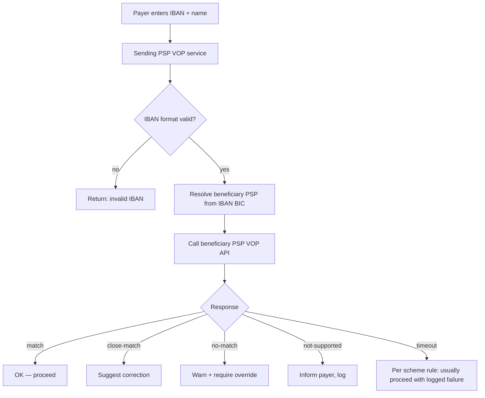

# VOP Check — L3 task

Verification of Payee. IBAN/name match before SCT / SCT Inst. Mandatory Oct 9 2025 under [[../regulations/instant-payments-regulation]].

## Inputs

- Beneficiary IBAN
- Beneficiary name (as entered by payer)
- Account type hint (natural person / legal entity) — optional

## Flow

## Possible outcomes

| Outcome | Payer UX | Liability |
|---|---|---|
| match | Pass through | Standard |
| close-match | Show suggested name | If override + wrong → payer liable |
| no-match | Hard warning, override gate | Override → payer liable for loss |
| not-supported | Inform, can proceed | Standard |
| timeout | Per scheme defaults | Logged, lower bar |

## SLA

- Sub-5s typical
- Within 10s SCT Inst budget — tight

## Privacy

- Returns confirmation only, NOT the actual name on file
- "Close match" returns the suggestion (controversial)
- Logged per [[../regulations/gdpr]] retention rules

## Tech

- API: EPC scheme rulebook (REST/JSON)
- Routing services: SurePay, iPiD, EBA Fraud and Pattern Detection
- Cache safe? Names change — short TTL only

## Linked

[[../concepts/vop]] · [[../concepts/cop]] · [[../controls/vop-control]] · [[originate-sct-inst]]
