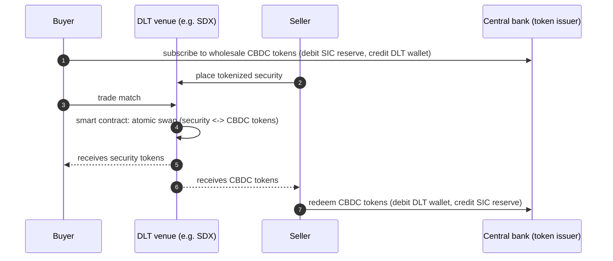

# Wholesale CBDC settlement — L2

Pattern for settling securities or FX leg via wholesale CBDC. Based on [[../concepts/project-helvetia]] live model.

## Sequence (DvP via wholesale CBDC on DLT)

## Key properties

- Atomic — both legs settle or neither
- Final + immediate
- 24/7 capable (subject to SNB issuance window)
- Programmable: conditional, multi-leg trades possible

## Cash mgmt integration

- Bank holds wallet of wholesale CBDC tokens
- Position counted alongside SIC reserves for liquidity purposes
- Daily reconciliation: DLT balance + SIC balance = total CB money
- New ops dimension: token wallet management, key custody

## Vs traditional T2S DvP

- Traditional: T2S coordinates DvP across CSD + DCA at NCB
- DLT: single platform for both legs, no inter-system messaging
- Reduces operational complexity, requires new tech stack

## Related

[[../concepts/wholesale-cbdc]] · [[../concepts/project-helvetia]] · [[../concepts/dlt-settlement]] · [[securities-cash-leg]]
