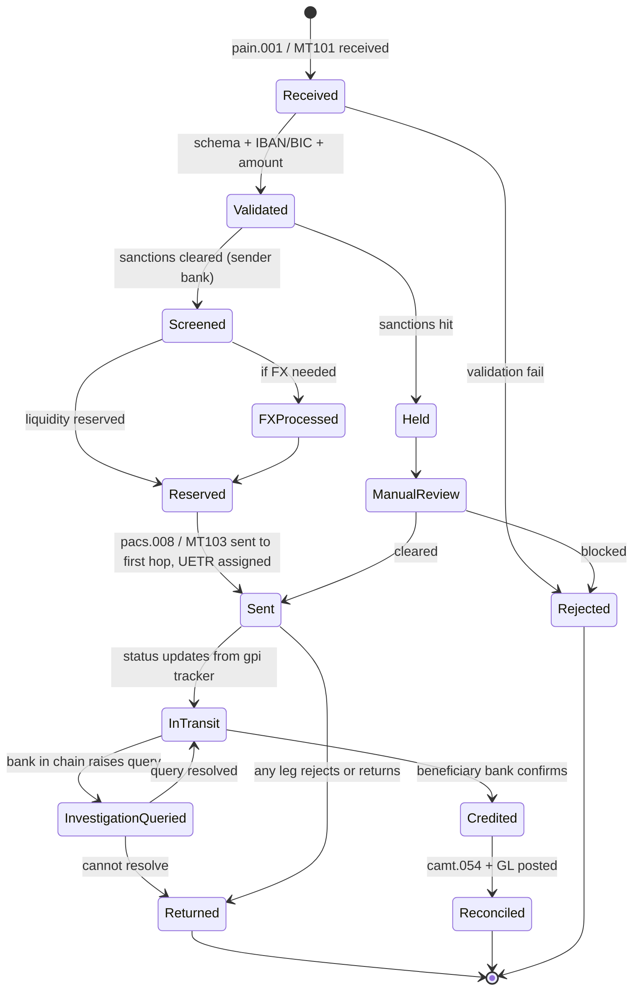

# Cross-border wire lifecycle

State machine for one cross-border SWIFT credit transfer.

## State semantics

| State | Owner | Notes |
|---|---|---|
| Received | Channel Gateway | pain.001 or MT101 inbound |
| Validated | Hub | schema + business rules |
| Screened | Screening | OFAC/EU/SECO/OFSI per [[../regulations/wtr-travel-rule]] |
| FXProcessed | FX desk | rate locked, FX leg booked |
| Reserved | Liquidity | nostro reservation |
| Sent | CSM Adapter | pacs.008 to first hop, UETR registered |
| InTransit | gpi tracker | per-hop status updates |
| InvestigationQueried | Ops | manual repair / KYC at correspondent |
| Credited | Hub | beneficiary bank confirmed |
| Returned | Hub | any leg failed |
| Reconciled | Recon | camt + GL posted |

## Key differences vs SCT Inst lifecycle

- Multi-hop — `InTransit` may have multiple status updates
- Investigation possible mid-flight
- Settlement is sequential per leg, not atomic
- Days, not seconds
- Recall is real (camt.056) but cooperation-dependent

## Linked

[[../processes/originate-cross-border-wire]] · [[../processes/gpi-tracking]] · [[payment-lifecycle]]
