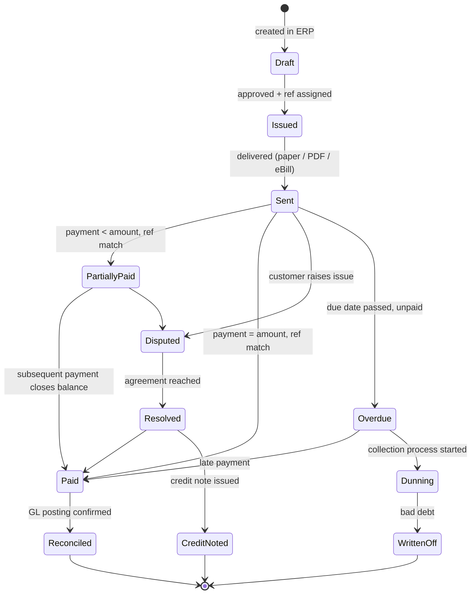

# Invoice lifecycle (QR-bill receivable)

State machine for one invoice from issuance to closed.

## State semantics

| State | Owner | Persisted? | Reversible? |
|---|---|---|---|
| Draft | ERP | Yes | Yes |
| Issued | ERP | Yes | Yes |
| Sent | ERP / billing system | Yes | No |
| PartiallyPaid | AR engine | Yes | Yes |
| Paid | AR engine | Yes | Yes (refund) |
| Disputed | Customer service | Yes | Yes |
| Resolved | Customer service | Yes | No |
| Overdue | Scheduled job | Yes | Yes |
| Dunning | Collections | Yes | Yes |
| WrittenOff | Finance | Yes | No |
| CreditNoted | Finance | Yes | No |
| Reconciled | GL | Yes | No |

## Events emitted

- `invoice.issued`
- `invoice.sent`
- `invoice.payment.applied` (with amount + ref)
- `invoice.disputed`
- `invoice.overdue`
- `invoice.dunning.started`
- `invoice.written-off`
- `invoice.reconciled`

## Linked

[[../processes/qr-bill-receivable]] · [[../processes/ar-reconciliation]] · [[../data/invoice-entity]]
