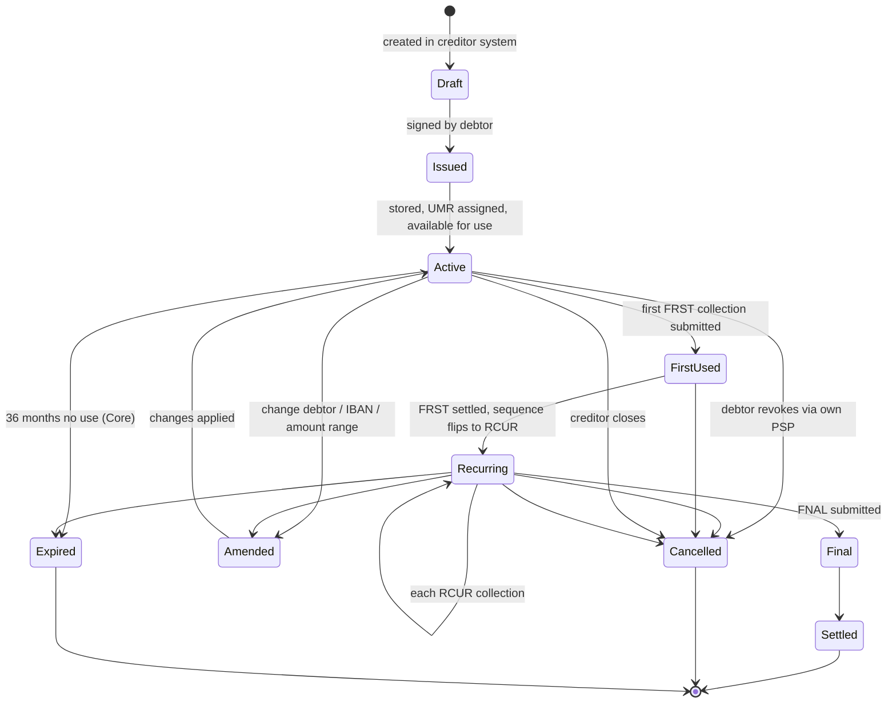

# Mandate lifecycle (SDD)

State machine for one SEPA Direct Debit mandate. Distinct from payment lifecycle — mandates persist across many collections.

## State semantics

| State | Owner | Persisted? | Reversible? |
|---|---|---|---|
| Draft | Creditor system | Yes | Yes |
| Issued | Creditor + debtor | Yes | Yes |
| Active | Creditor system | Yes | Yes |
| FirstUsed | Creditor + collection ref | Yes | No (sequence advances) |
| Recurring | Creditor | Yes | No |
| Amended | Creditor | Yes | Yes (re-amend) |
| Cancelled | Either party | Yes | No |
| Expired | Auto / scheduled job | Yes | No |
| Final | Creditor (last collection) | Yes | No |

## Implementation hints

- One Mandate row, many Collection rows referencing it
- UMR + CID composite key
- Audit log every state change (regulator + dispute defense)
- Document storage tier separate from OLTP (S3 / GCS / object store + KMS)

## Linked

[[../processes/sdd-mandate-lifecycle]] · [[../data/mandate-entity]] · [[../concepts/sepa-mandate]]
