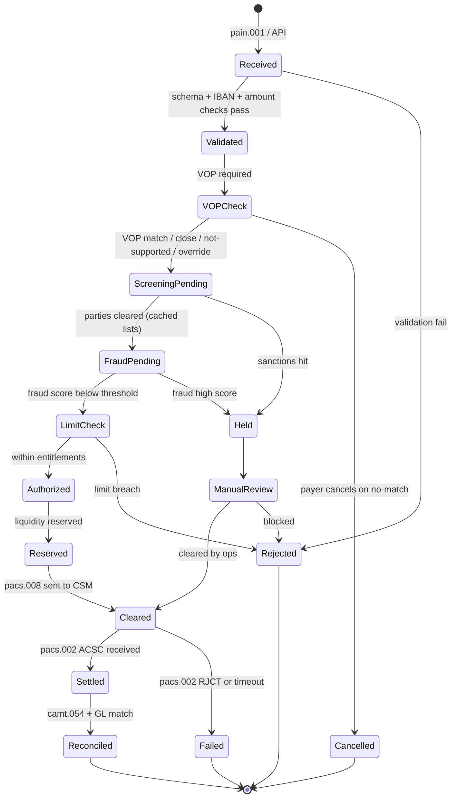

# Payment lifecycle (SCT Inst)

State machine for one payment from corporate initiation to final reconciled state.

## State semantics

| State | Owner | Persisted? | Reversible? |
|---|---|---|---|
| Received | Channel Gateway | Yes | Yes |
| Validated | Hub | Yes | Yes |
| VOPCheck | Hub + VOP svc | Yes | Yes |
| ScreeningPending | Hub + Screening | Yes | Yes |
| FraudPending | Hub + Fraud | Yes | Yes |
| LimitCheck | Hub | Yes | Yes |
| Authorized | Hub | Yes | Yes |
| Reserved | Hub + Liquidity | Yes | Yes (release) |
| Cleared | Hub | Yes | No (rail-irrevocable) |
| Settled | Hub | Yes | No |
| Reconciled | Recon Service | Yes | No |
| Held | Hub + Ops | Yes | Yes |
| ManualReview | Ops | Yes | Yes |
| Failed | Hub | Yes | No |
| Rejected / Cancelled | Hub | Yes | No |

## Idempotency

- Each transition emits domain event with `paymentId` + `endToEndId` + `version`
- Replays handled via state + version check
- Critical for retries on CSM timeout

## Implementation hints

- Persist via event-sourced log + projection (read model)
- Or single-row update with optimistic locking on `version` column
- Each transition = bus event for downstream (notifications, reporting, recon)

## Linked

[[../processes/originate-sct-inst]] · [[../architecture/sct-inst-logical]] · [[../data/payment-entity]]
