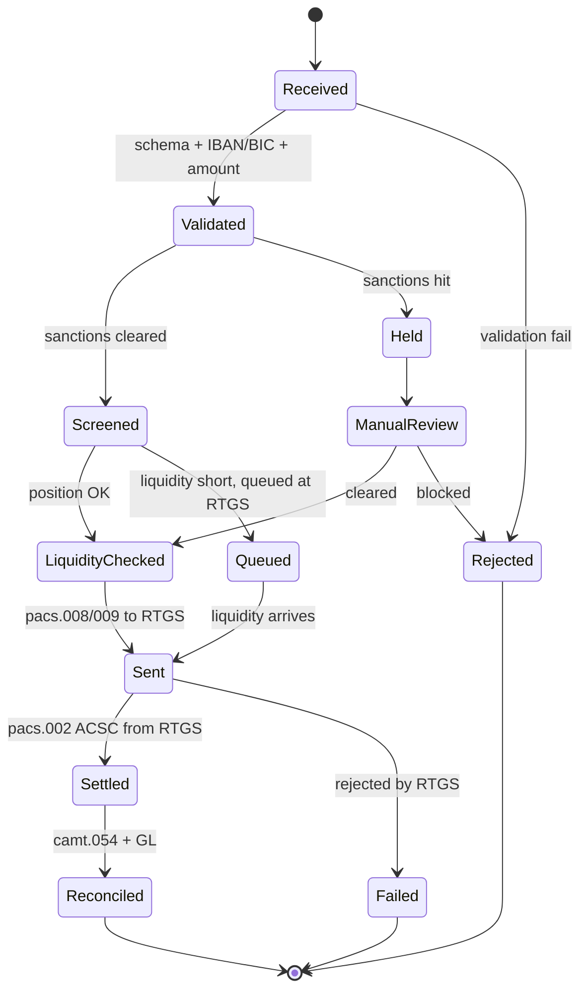

# RTGS wire lifecycle (CHAPS / T2 / SIC)

## Differences vs SCT Inst lifecycle

- No VOP step (RTGS messages can carry VOP outcome from prior layer if used)
- Liquidity check is hard gate — RTGS will queue or reject
- Sent → Settled is operator-side, not multi-hop
- Days are not in scope — same-day settlement for all happy paths

## Linked

[[../processes/originate-rtgs-wire]] · [[payment-lifecycle]] · [[cross-border-wire-lifecycle]]
