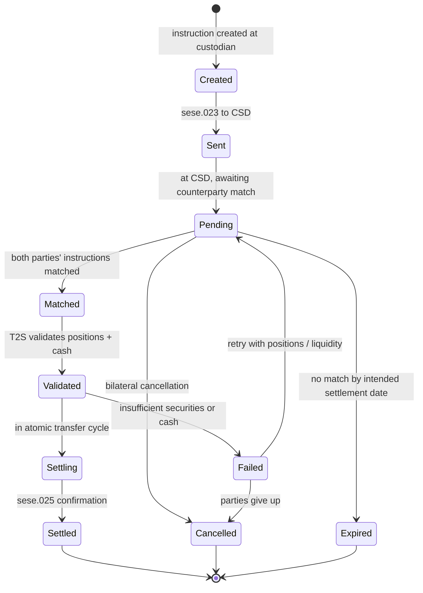

# Settlement instruction lifecycle (T2S DvP)

## State semantics

| State | Owner | CSDR penalty? |
|---|---|---|
| Created | Custodian | No |
| Sent | Custodian + CSD | No |
| Pending | CSD | No (until ISD) |
| Matched | CSD | No (until ISD) |
| Validated | T2S | No |
| Settling | T2S | No |
| Settled | T2S | No |
| Failed (post-ISD) | Failing party | **Yes — cash penalty per day** |
| Cancelled | Bilateral | No |

## Penalty calculation under [[../concepts/csdr]]

- Trigger: state = Failed AND date > ISD
- Daily charge: rate × (trade value × failed period)
- Settled via CSD daily penalty mechanism
- Aggregated monthly, paid via CSD

## Linked

[[../processes/securities-cash-leg]] · [[../concepts/csdr]] · [[../data/sese-messages]]
